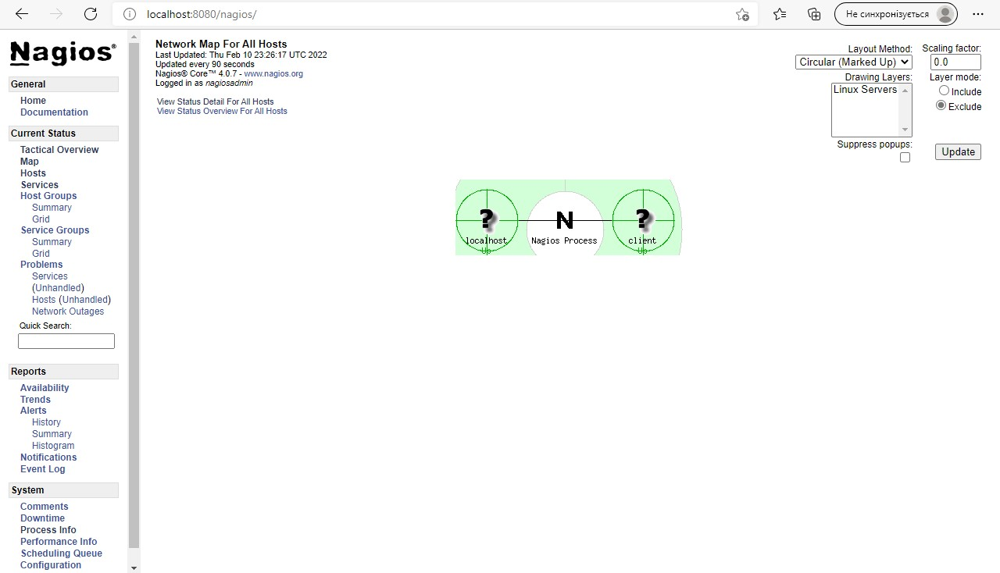

# PART 1

## Answer 1:
1. VMware vSphere/ESXi
2. Microsoft Widows Server Hyper-V
3. Oracle XEN
4. Red Hat Enterprised Virtualization(RHEV)

## Answer 2:
VMware vSphere/ESXi is a monolithic hypervisor and led the market
in developing innovative features such as:\
-memory overcommitment;\
-graphical interface;\
-high availability of centralized managment;\
-Scale up to 512 VM's per host, up to 2048 vCPU's per host,up to \
64 vCPU's and 1 Tb of vRAM per VM.\
While Microsoft Windows Server Hyper-V is a microkernel hypervisor\
-Scale up to 320 logical CPU's, 4 Tb of vRAM, 2048 vCPU's per host\
and 64 vCPU's and 1 Tb vRAM per VM and 64 nodes/8000 VM's per \
cluster

# PART 2

## VirtualBox

1. Downloaded VirtualBox and Linux ubunutu server x64 version
2. VM1 created 

3. Linux ubunutu server intallation started on VM1, machine name set to 'macneon_zashkilniak'

4. Linux installation successfully finishd

5. Cloning VM1->VM2

6. Creating group of VM's: VM1 and VM2 and learning group functions
7. Creating tree of several different snapshots for VM1

8. Exporting VM1 to file in Open virtualization format 2.0

9. Importing VM1.ova to VirtualBox as new machine VM3

10. Configuring USB to use hosts USB port on VM1

11. Configuring Shared Folder to use on VM1

12. Configuring different network modes for VM1, VM2. Makeing a table of possible connections

|   Mode   |VM>Host| VM<Host|VM<>VM|VM>Net/LAN|VM<Net/LAN|
|----------|-------|--------|------|----------|----------|
|Host-only |  Yes  |   Yes  | Yes  |     No   |     No   |
|Internal  |   No  |    No  | Yes  |     No   |     No   |
|Briged    |  Yes  |   Yes  | Yes  |    Yes   |    Yes   |
|NAT       |  Yes  |port-fwd|  No  |    Yes   | port-fwd |
|NATservice|  Yes  |port-fwd| Yes  |    Yes   | port-fwd |

13. Executing command line and examine vboxmanage cosole commands

## Vagrant

1.Downloading and installing Vagrant, ading path to Vargant to Windows varibles
2. Crearing directory Zashkilniak in C:\Temp directory, and iniializing there enviroment for
vargant box hashicorp/precise64

3. Executing vagrant up command

4. Connecting to the VM using the program MobaXterm, and executing date command

5. Stoping and deleting of created VM

6. Creating own box in vagrant with centos

and executing Date command on VM

## optional task
Used link from references
(https://www.cyberciti.biz/cloud-computing/use-vagrant-to-create-small-virtual-lab-on-linux-osx/)
Created test enviroment consistibg 2 hosts: server and client, both operating ubunutu linux
on server side Nagios service started monitoring enviroment.

