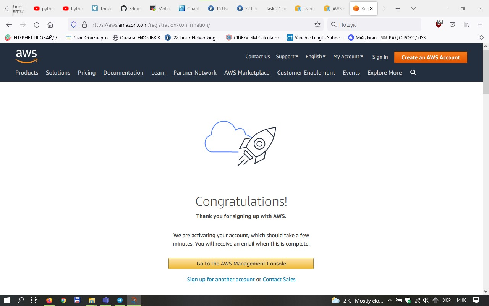
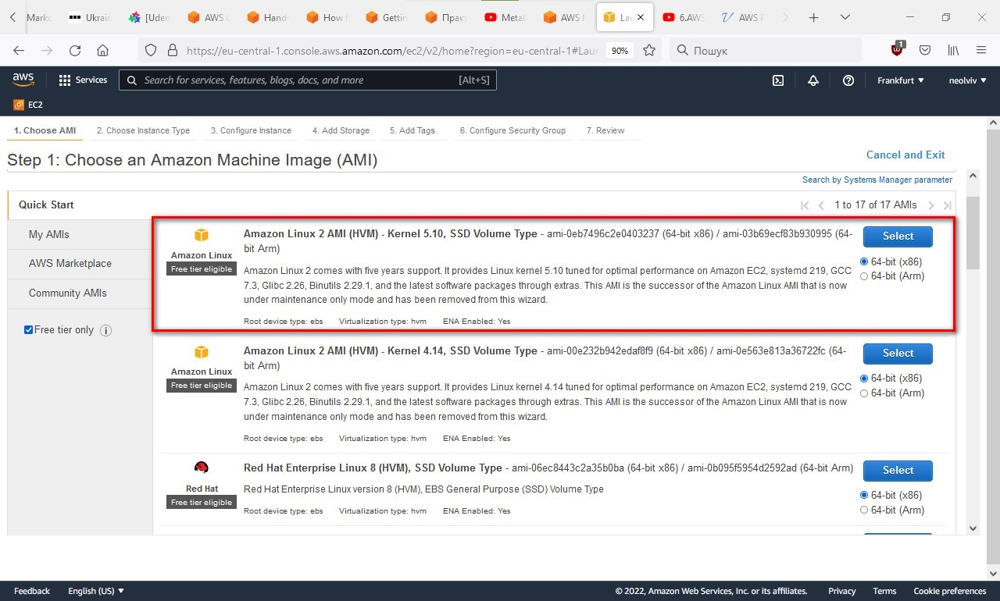
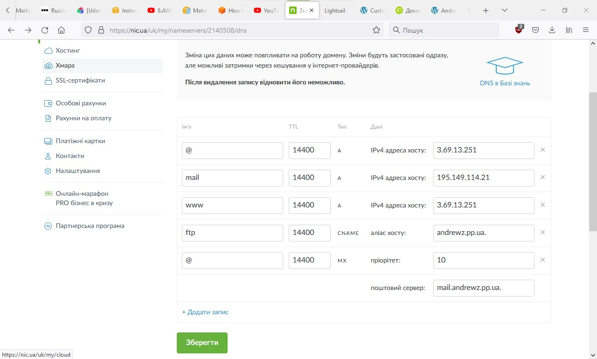

## TASK 2.2

### 1. Reviewed all terms of using AWS Free Tier
### 2. Signed up for Amazon Web Services.

  
Click to expand!

  
  

### 3. Found the hands-on toturials and AWS Well-Architected labs and explored list of step-by-step tutorials
### 4. Reviewed Getting started with Amazon EC2.
-According to results of AWS cloud ping test (https://cloudpingtest.com/aws)
Most suitable region for my ISP is Europe (Frankfurt) | eu-central-1

  
Click to expand!

  
  

-Changing region to Europe (Frankfurt) | eu-central-1

  
Click to expand!

  
  

-Created instance with Amazon Linux 2(CentOS) operating system

  
Click to expand!

  
  

-choosing instance type

  
Click to expand!

  
  

-configuring instance details(1 instance)

  
Click to expand!

  
  

-configuring storage

  
Click to expand!

  
  

-adding Name tag

  
Click to expand!

  
  

-creating new Security Group for SSH connection with defined source ip of my home router

  
Click to expand!

  
  

-reviewing instance before launching

  
Click to expand!

  
  

-creating a new key pair and downloading into file

  
Click to expand!

  
  

-checking running instances

  
Click to expand!

  
  

-connected to instance using mobaXterm application, configuring client

  
Click to expand!

  
  

-working on ssh shell

  
Click to expand!

  
  

### 5. Creating a snapshot of instance to keep as backup, select instance>Actions>Image and Templates>Create template from instance

  
Click to expand!

  
  
  

### 6. Creating and attach a Disk_D(EBS) to instance to add more storage spave

  
Click to expand!

  
  
  

-attaching volume to instance #1

  
Click to expand!

  
  

-creating and storing some files on Disk_D

  
Click to expand!

  
  
  

### 7. Launching the second instance from backup(from Instances menu choosing Launch Templates)

  
Click to expand!

  
  
  

### 8. Detaching Disk_D from 1st instance and attaching Disk_D to new instance

  
Click to expand!

  
  

-Connecting to instance #2 and mount EBS Disk_D

  
Click to expand!

  
  

### 9. Reviewed an example of creating own domain
-crating own domain andrewz.pp.ua

  
Click to expand!

  
  
  

-done

  
Click to expand!

  
  

### 10. Launching and configuring a WordPress instance with Amazon Lightsail
-creating instance

  
Click to expand!

  
  

-creating ssh key pair and choosing instance plan

  
Click to expand!

  
  

-identifing instance

  
Click to expand!

  
  

-instance created

  
Click to expand!

  
  

-connecting to instance command line and viewing password to WordPress managment interface

  
Click to expand!

  
  

-connecting to WordPress web managment interface

  
Click to expand!

  
  

-getting static ip for instance

  
Click to expand!

  
  

-attaching our instance static ip address to pp.ua nameserver

  
Click to expand!

  
  

-accessing WordPress website directly by ip

  
Click to expand!

  
  

### 11. Reviewed the tour on S3 Service
-creating own S3 repository

  
Click to expand!

  
  

-repository "andrews-1-bucket" created

  
Click to expand!

  
  

-uploading "IP_MASK.JPG" file to "andrews-1-bucket" repository

  
Click to expand!

  
  

-file successfuly uploaded

  
Click to expand!

  
  

-trying to download file to local folder

  
Click to expand!

  
  

-deleting files from bucket

  
Click to expand!

  
  

-successfuly deleted

  
Click to expand!

  
  

### 12. Reviewed the example on using the AWS CLI with Amazon S3
-creating a user with AWS IAM

  
Click to expand!

  
  
  
  

-user created

  
Click to expand!

  
  

-configure AWS CLI and upload any files to S3

  
Click to expand!

  
  
  

### 13. Reviewed the example on deploying Docker Containers on Amazon Elastic Container Service (Amazon  ECS)  
-configuring instance, installing updates and docker

  
Click to expand!

  
  
  

-creating Dockerfile and adding code inside, building Docker image and verifing image was created correctly

  
Click to expand!

  
  

-runnning docker image

  
Click to expand!

  
  

-trying to connect to instance from external by ip adreess to ensure Docker running and hosting container

  
Click to expand!

  
  

-creating an Amazon ECR repository to store image

  
Click to expand!

  
  

-taging the hello-world image and running the aws ecr get-login-password command

  
Click to expand!

  
  

-Push the image to Amazon ECR

  
Click to expand!

  
  

-private repositories on AWS ECS managment console

  
Click to expand!

  
  

### 14. Runing a Serverless "Hello, World!" with AWS Lambda
-entering AWS Lambda managment interface

  
Click to expand!

  
  

-creating function in AWS Lambda managment interface

  
Click to expand!

  
  

-configuring blueprint

  
Click to expand!

  
  

-function created

  
Click to expand!

  
  

-configuring test event

  
Click to expand!

  
  

-running function and reviewing execution result

  
Click to expand!

  
  

-viewing CloudWatch metrics of used resources

  
Click to expand!

  
  

### 15. Creating a static website on Amazon S3
-creating new bucket andrewz.pp.ua

  
Click to expand!

  
  

-configuring static wrbsite hosting for created bucket

  
Click to expand!

  
  

-got bucket website endpoint address

  
Click to expand!

  
 

-configuring polices of the bucket

  
Click to expand!

  
  

-uploaded index.html and me.jpg(my photo according to the task)

  
Click to expand!

  
  

-configuring domain ns server

  
Click to expand!

  
  

-result of visiting http://www.andrewz.pp.ua/ is redirection to static website on Amazon S3

  
Click to expand!

  
  

