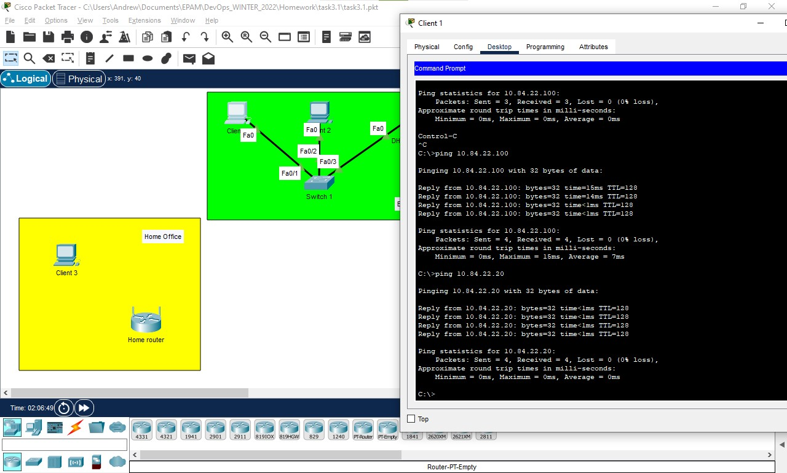
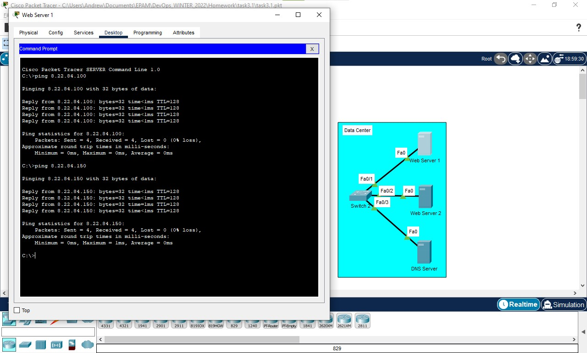
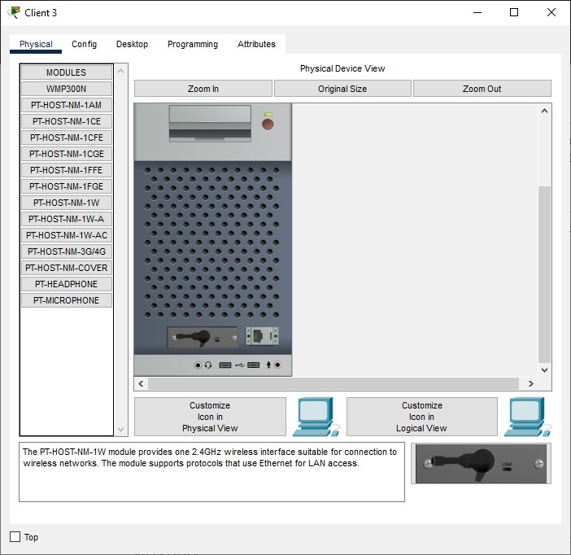
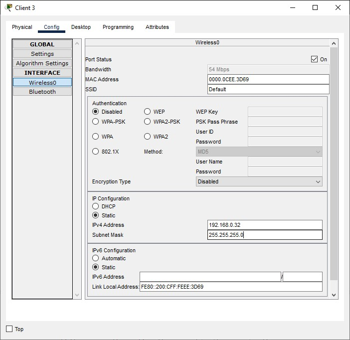
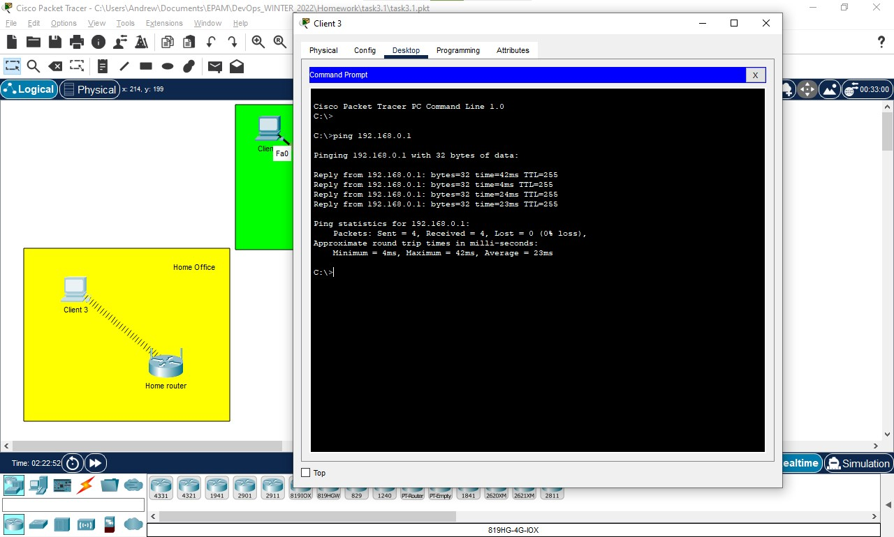
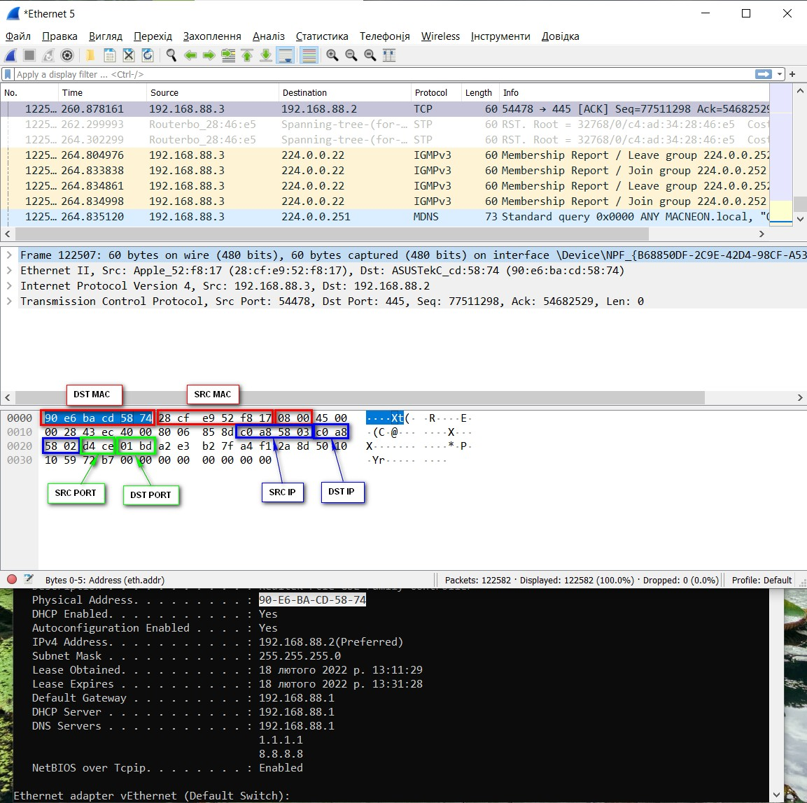

## TASK 3.1

### 1. Creating network as illustrated at task picture

### 2. On he Enterprise segment, according to instructions such ip was assigned:
Network: 10.84.22.0/24\
Client 1: 10.84.22.10/24\
Client 2: 10.84.22.20/24\
DHCP Server: 10.84.22.100/24\

### 3. Trying to ping Enterprise segment machines

### 4. On he Data Center segment, according to instructions such ip was assigned:
Network: 8.22.84.0/24\
Web Server 1: 8.22.84.50/24\
Web Server 2: 8.22.84.100/24\
DNS Server: 8.22.84.150/24\

### 5. Trying to ping Enterprise segment machines

### 6. Changing network adapter on Clien 3 machine to PT-HOST-NM-1W. Mind to turn off machine before changing adapters

### 7. Changing Clinet 3 IP address according to instructions
Clint 3: 192.168.0.32

### 8 Trying to ping out Router from Client 3 machine.

### ADDITIONAL TASK

WireShark was started on destination machine. From source machine file "Wireshark-win64-3.6.2.exe"\
was copied to shared folder on destination machine, then wireshark observation was analyzed

#### Source MAC: 28:cf:e9:52:f8:17
#### Destination MAC: 90:e6:ba:cd:58:74
#### Source IP: 192.168.88.3
#### Destination IP: 192.168.88.2
#### Source TCP: 54478
#### Destination TCP: 445
