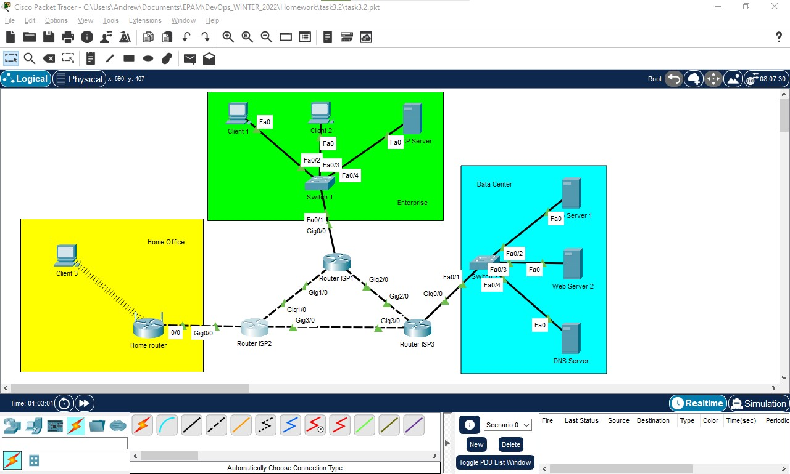
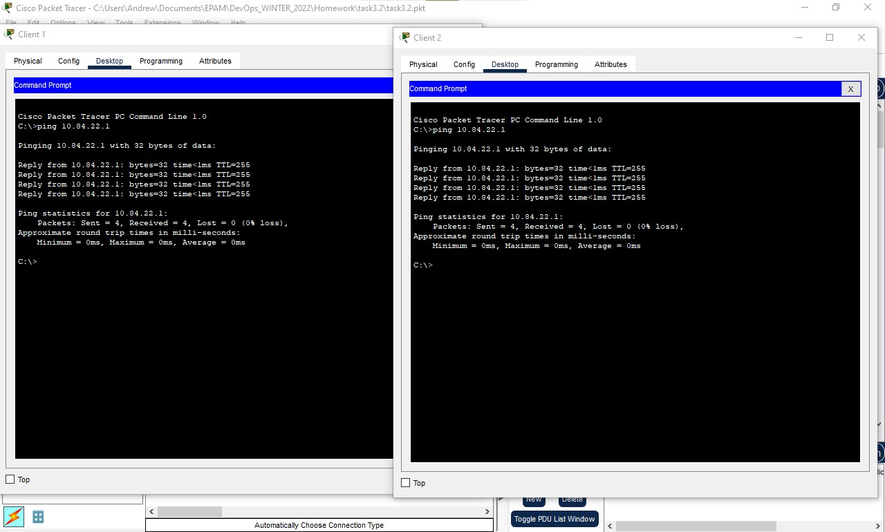
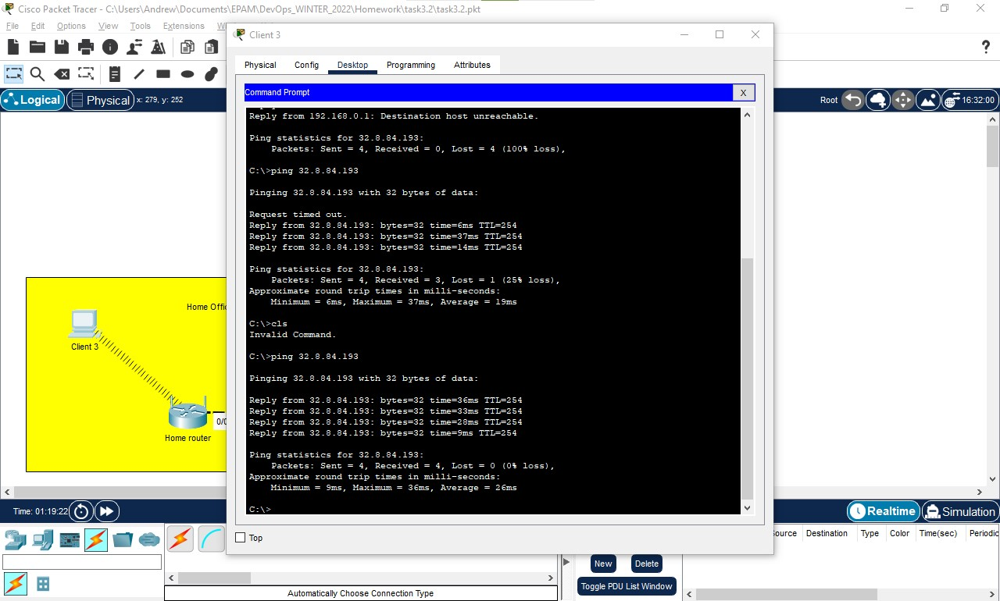
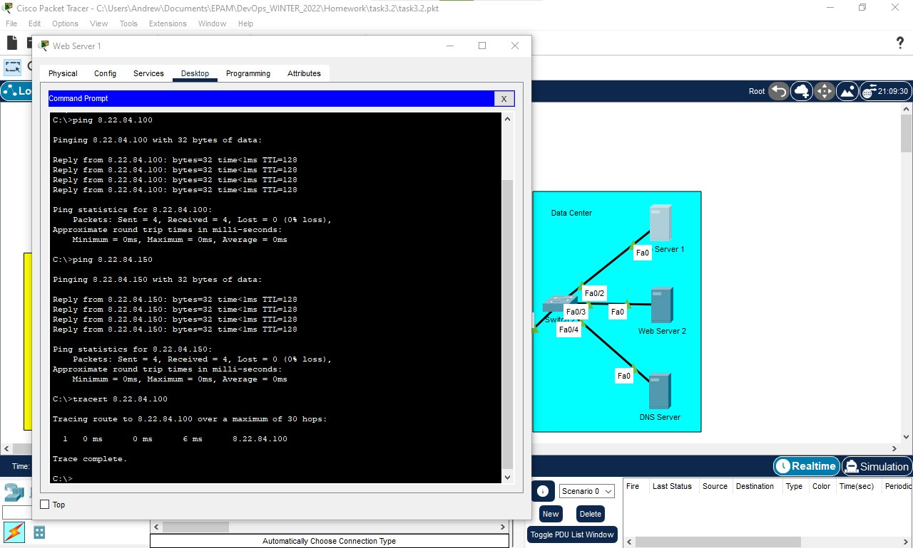
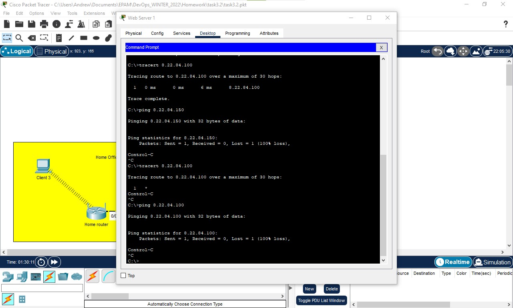
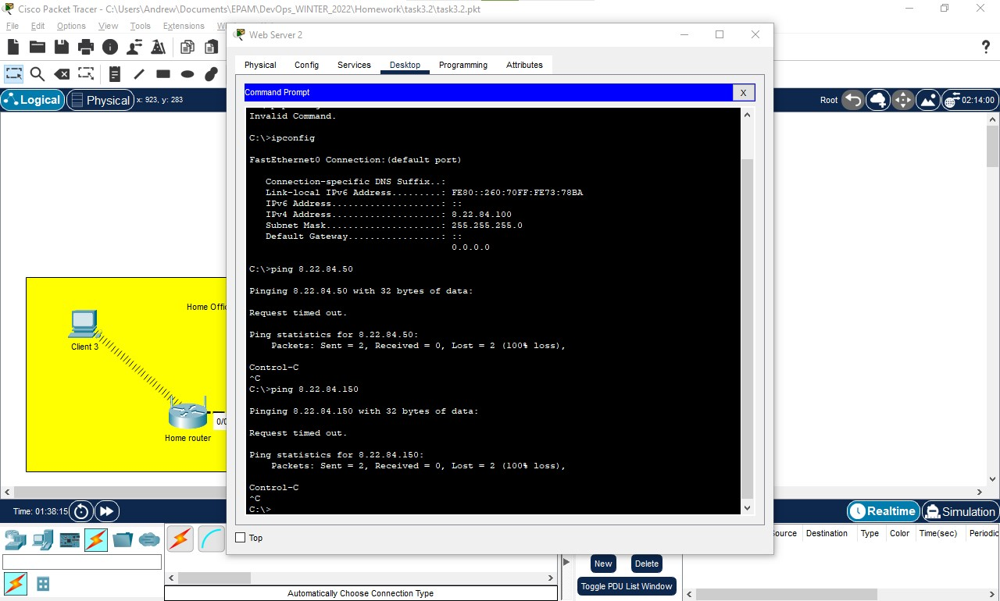
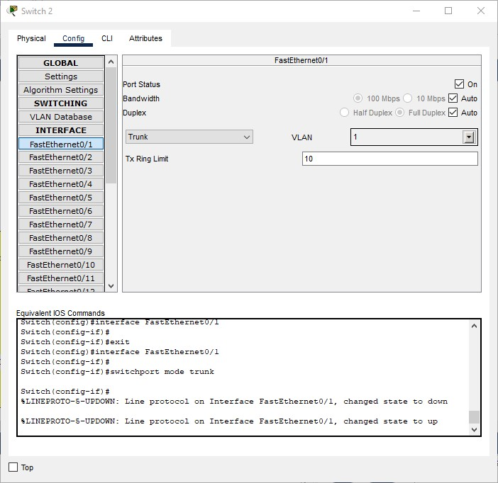
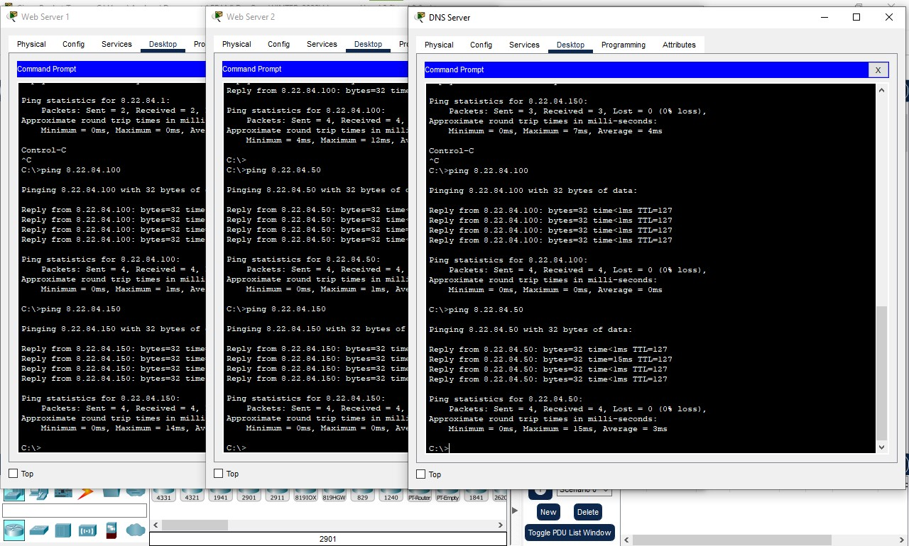
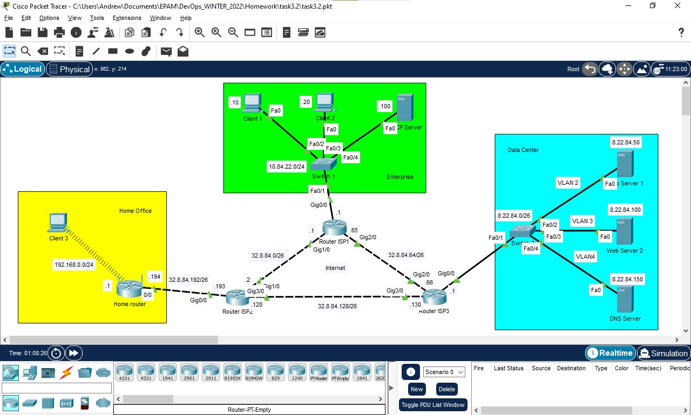

## TASK 3.2

### 1. Creating Internet segment as illustrated at task picture

  
Click to expand!

  
  

### 2. According to task, using next network settings for created Internet Segment

#### Network: 32.8.84.0/24

Deviding this network on 4 segments:

#### Segment #1 (Router ISP1<->Router ISP2)
Network:32.8.84.0/26\
Router ISP1 Gig1/0 IP: 32.8.84.1\
Router ISP2 Gig1/0 IP: 32.8.84.2\
Subnet Mask: 255.255.255.192

#### Segment #2 (Router ISP1<->Router ISP3)
Network:32.8.84.64/26\
Router ISP1 Gig2/0 IP: 32.8.84.65\
Router ISP3 Gig2/0 IP: 32.8.84.66\
Subnet Mask: 255.255.255.192

#### Segment #3 (Router ISP2<->Router ISP3)
Network:32.8.84.128/26\
Router ISP2 Gig3/0 IP: 32.8.84.129\
Router ISP3 Gig3/0 IP: 32.8.84.130\
Subnet Mask: 255.255.255.192

#### Segment #4 (unused)
Network:32.8.84.192/26\
Subnet Mask: 255.255.255.192

Mind to turn configured interfaces On

### 3. According to task, applying next configuration
Router ISP1 Gig0/0 IP: 10.84.22.1/24\
Router ISP3 Gig0/0 IP: 8.22.84.1/24\
Using Segment #4 from previous step to assign it to Router ISP2<->Home router
Segment #4 (Router ISP2<->Home Router)\
Network:32.8.84.192/26\
Router ISP2 Gig0/0 IP: 32.8.84.193\
Home Router 0/0 IP: 32.8.84.194\
Subnet Mask: 255.255.255.192\
Mind to turn configured interfaces On

### 4. On Client machines assigning Gateways
Client 1 and Client 2 Gateways value set to 10.84.22.1\
On Client 3 Gateway automatically assigned by Home router internal DHCP server

### 5. Pinging Gateways from Clients 1,2 and 3 (10.84.22.1 for Client 1 and Client 2; 32.8.84.193 for Client 3)

  
Click to expand!

  
  
  

### 6. Trying connection between Server machines on Data Center segment of the network

  
Click to expand!

  
  

### 7. Changing Subnet Mask for Web Server 1, Web Server 2 and DNS Server to 255.255.255.192

### 8. After changing Subnet Mask, trying connection between Server machines on Data Center segment of the network

  
Click to expand!

  
  

#### Now Servers can't rich each other, It happaned because of changing the subnet mask to 255.255.255.192, simply we devide network 8.22.84.0 onto 4 isolated segments
For example:\
we have created such 4 networks from 8.22.84.0\
Network 1 - 8.22.84.0;   IP RANGE from 8.22.84.1 to 8.22.84.62;    BROADCAST IP - 8.22.84.63\
Network 2 - 8.22.84.64;  IP RANGE from 8.22.84.65 to 8.22.84.126;  BROADCAST IP - 8.22.84.127\
Network 3 - 8.22.84.128; IP RANGE from 8.22.84.129 to 8.22.84.190; BROADCAST IP - 8.22.84.191\
Network 4 - 8.22.84.192; IP RANGE from 8.22.84.193 to 8.22.84.254; BROADCAST IP - 8.22.84.255\
From this table we can see that all Server IP's belongs to separated networks:\
Web Server 1 IP 8.22.84.50 belongs to Network 1\
Web Server 2 IP 8.22.84.100 belongs to Network 2\
DNS Server IP 8.22.84.150 belongs to Network 3

### 9. Arranging connections on Data Center segment of network according to task
on Data Center Switch creating VLAN's 2,3 and 4 and then assigning them to\
Fa0/2 -> VLAN 2\
Fa0/3 -> VLAN 3\
Fa0/4 -> VLAN 4

### 10. After implementation of VLAN's, trying connection between Server machines on Data Center segment of the network

  
Click to expand!

  
  

#### Servers still can't rich each other, It happaned because Servers is located on separated networks and VLAN's

### 11. Skiping this step to 12 (Additional tasks)

## ADDITIONAL TASKS

### 12. Setting Data Center switch interface Fa0/1 to TRUNK

  
Click to expand!

  
  

### 13. Deleting IP and Subnet Mask from Gig0/0 interface of Router ISP3

### 14. Using CLI intrface of Router ISP3 executing commands
interface GigabitEthernet0/0.2\
encapsulation dot1Q 2\
ip address 4.25.99.1 255.255.255.192\
interface GigabitEthernet0/0.3\
encapsulation dot1Q 3\
ip address 4.25.99.65 255.255.255.192\
interface GigabitEthernet0/0.4\
encapsulation dot1Q 4\
ip address 4.25.99.129 255.255.255.192

### 15. Configuring Gateways for Data Center Servers
8.22.84.1 for Web Server 1\
8.22.84.65 for Web Server 2\
8.22.84.129 for DNS Server 

### 16. Trying connection between Server machines on Data Center segment of the network

  
Click to expand!

  
  

### RESULT: Data Center segment Servers can ping each other

  
Click to expand!

  
  Created network
  

