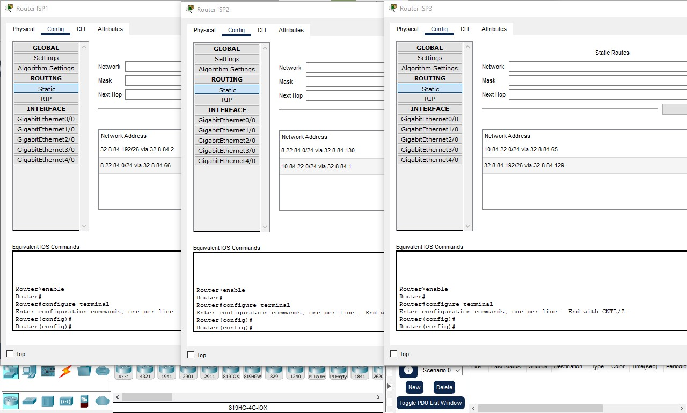
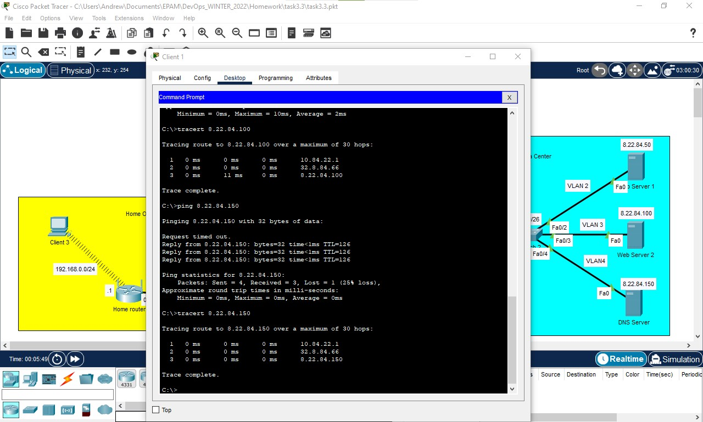
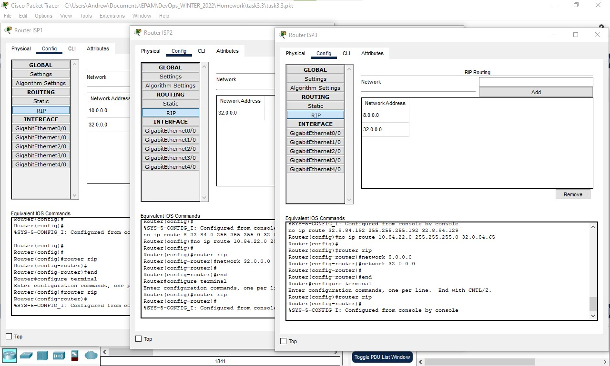
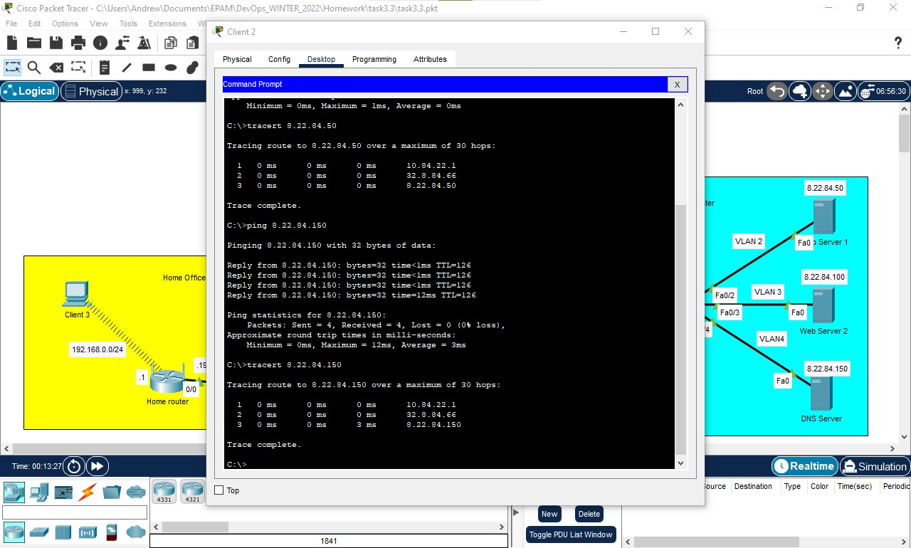

## TASK 3.3

### 1. Bulding the table of actual routes connectios of Internet segment for better understanding 
| Router | Interface | Network IP Addr | Host IP Addr |
|--------|-----------|-----------------|--------------|
| ISP1   | Gig0/0    | 10.84.22.0/24   | 10.84.22.1   |
| ISP1   | Gig1/0    | 32.8.84.0/26    | 32.8.84.1    |
| ISP1   | Gig2/0    | 32.8.84.64/26   | 32.8.84.65   |
| ISP2   | Gig0/0    | 32.8.84.192/26  | 32.8.84.193  |
| ISP2   | Gig1/0    | 32.8.84.0/26    | 32.8.84.2    |
| ISP2   | Gig3/0    | 32.8.84.128/26  | 32.8.84.129  |
| ISP3   | Gig0/0    | 8.22.84.0/24    | 8.22.84.1    |
| ISP3   | Gig2/0    | 32.8.84.64/26   | 32.8.84.66   |
| ISP3   | Gig3/0    | 32.8.84.128/26  | 32.8.84.130  |
| Home   | Internet  | 32.8.85.192/26  | 32.8.84.194  |

According to the table building routes and adding them to router settiings as described at next picture

  
Click to expand!

  
  

### 2. Already made this step in previous task (Task3.2, step 3,4,5)

### 3. Trying to ping and traceroute machines in different network segments

  
Click to expand!

  
  

### 4. Deketing static routes from ISP Router's

### 5. Adding next RIP routing addresses to router
Router ISP1:\
10.0.0.0\
32.0.0.0\
Router ISP2:\
32.0.0.0\
Router ISP3:\
8.0.0.0\
32.0.0.0

  
Click to expand!

  
  

### 6. Trying to ping and traceroute machines in different network segments

  
Click to expand!

  
  

