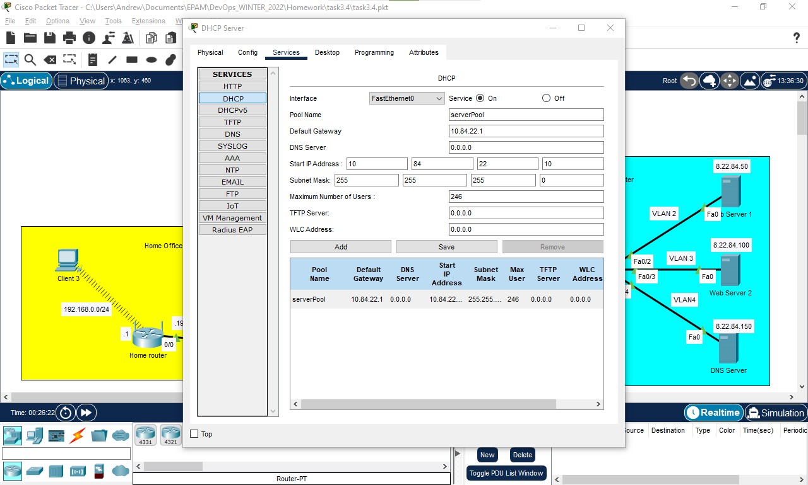
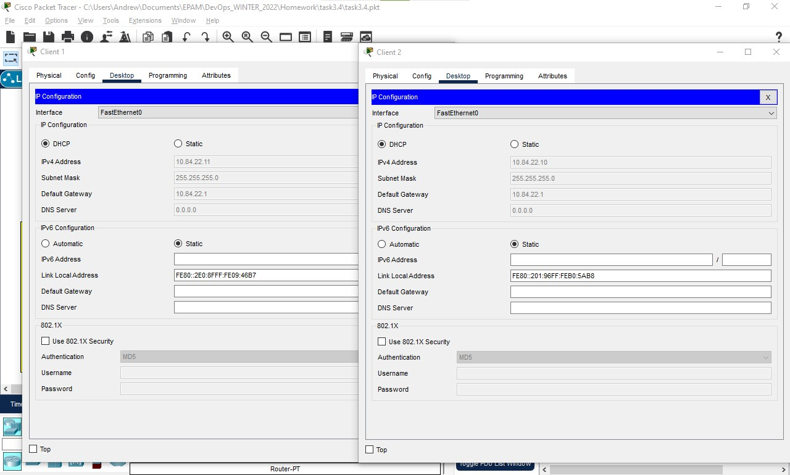
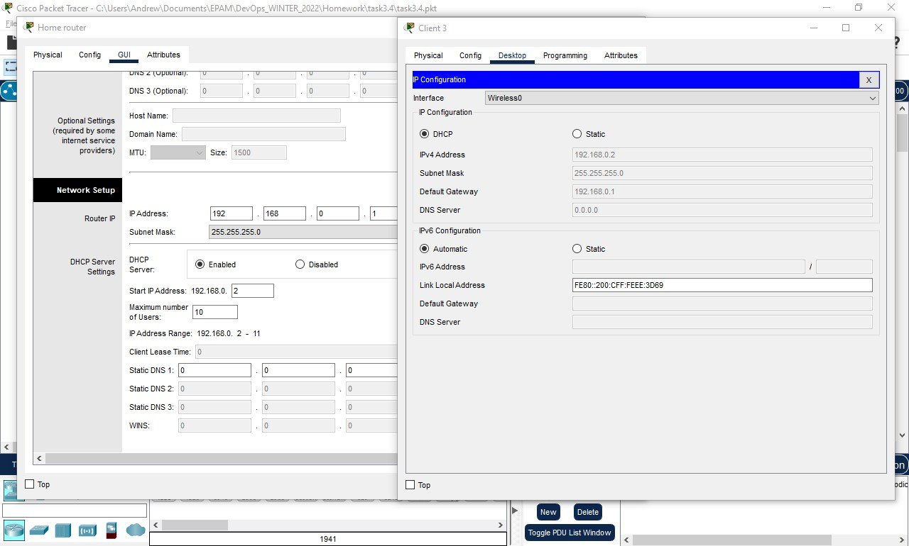
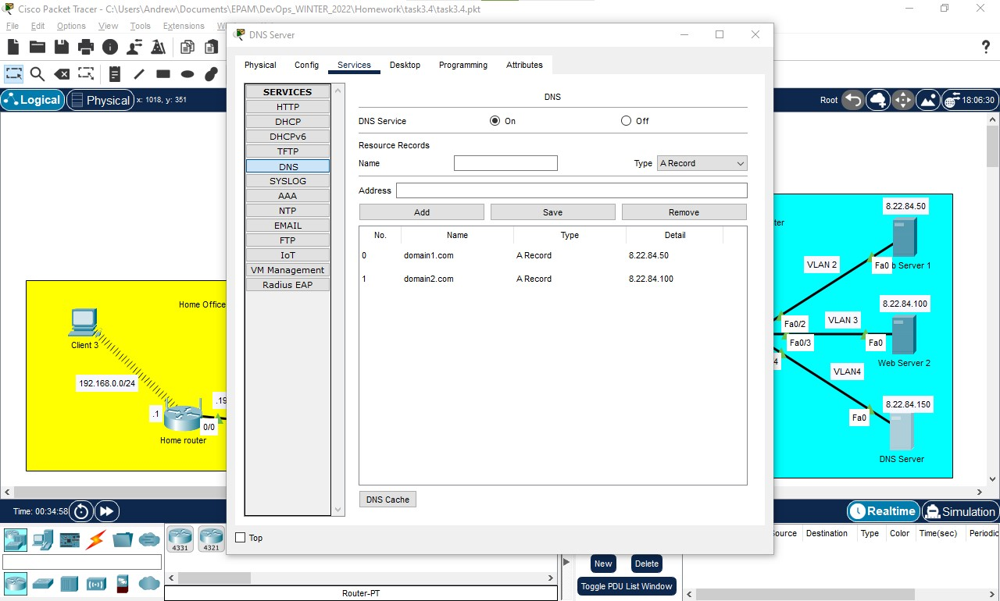
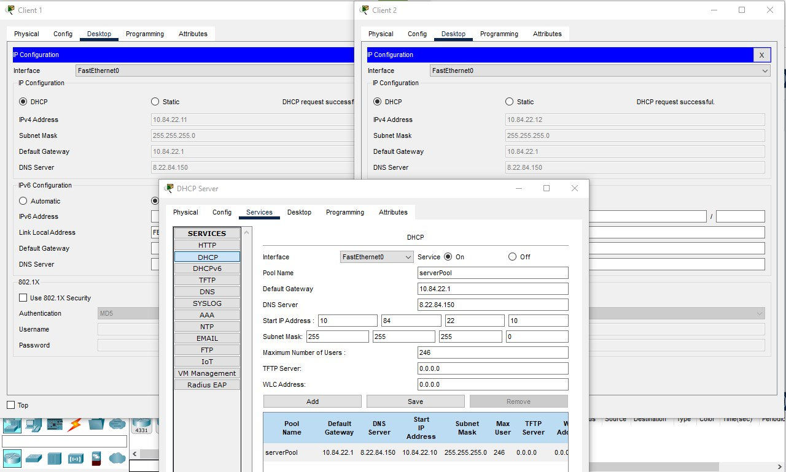
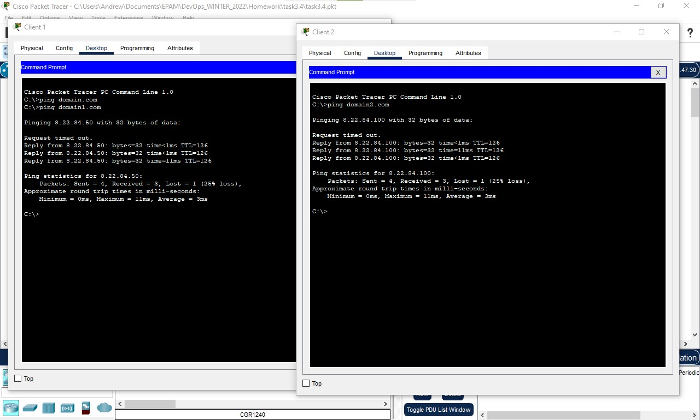
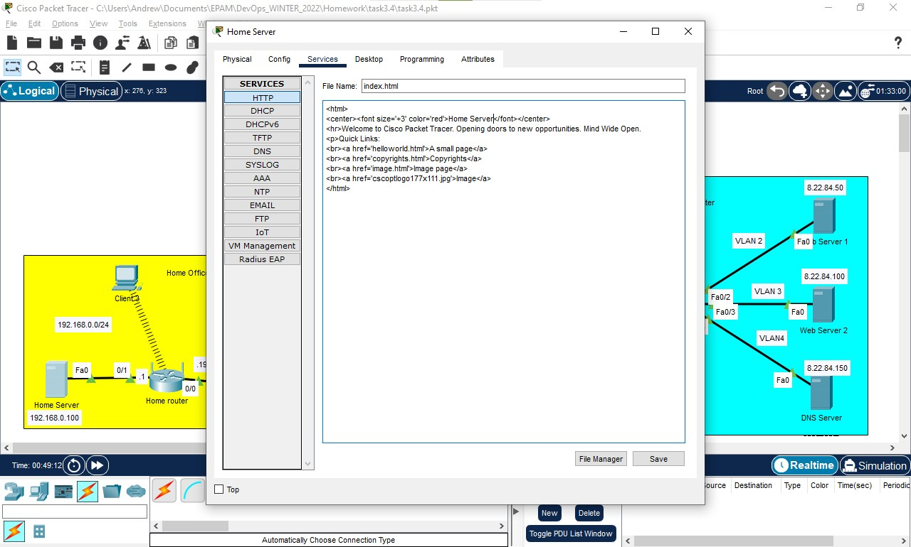
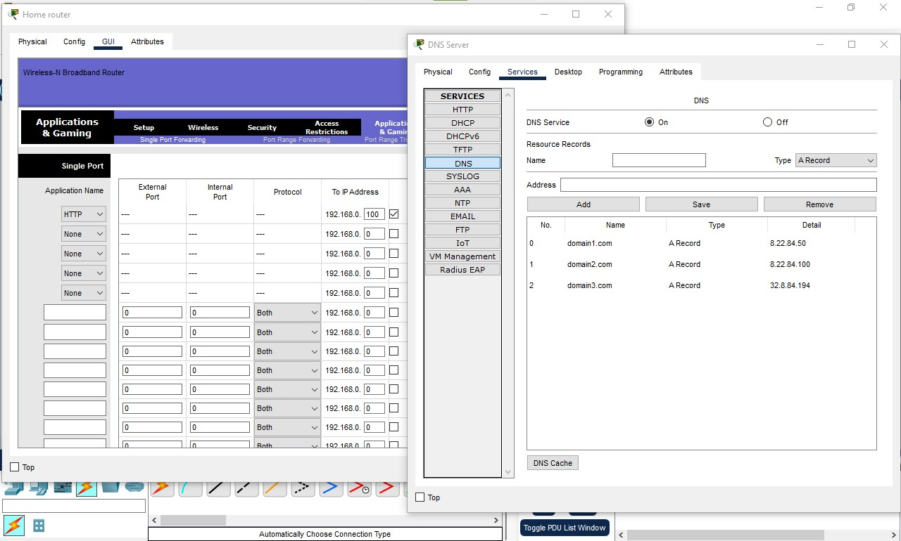
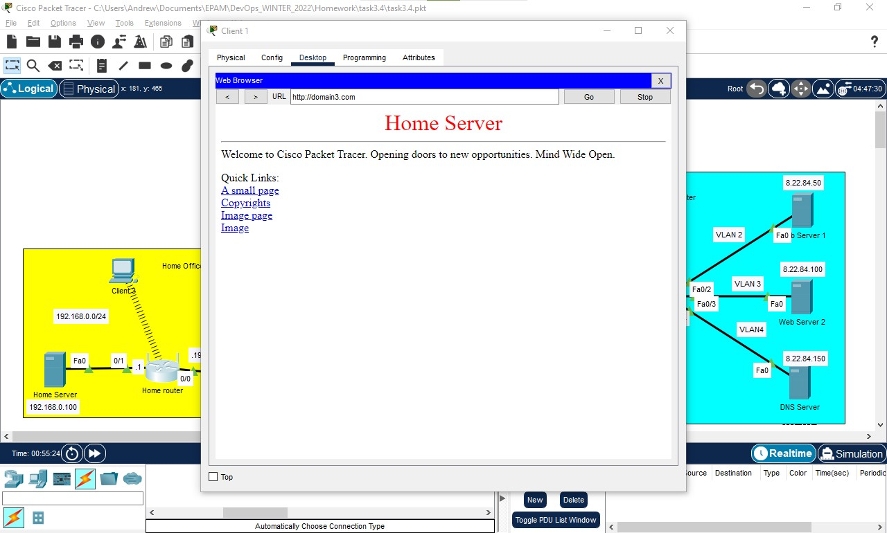

## TASK 3.4

### 1. Configuring DHCP on Enterpeise segment of network

### 2. Configuring DHCP Pool for 10.84.22.0/24 network, first IP - 10.84.22.10

  
Click to expand!

  
  

### 3. Trying to resolve IP from DHCP Server on Client 1 and Client 2

  
Click to expand!

  
  

### 4. Configuring DHCP on Home Router and trying to resolve IP on Client 3

  
Click to expand!

  
  

### 5. Configuring DNS Server

### 6. Adding DNS records for domain1.com and domain2.com on DNS Server

  
Click to expand!

  
  

### 7. Adding DNS Server IP to DHCP Server configuration

  
Click to expand!

  
  

### 8. Trying to ping domain1.com from Client 2 and Client 3 machines

  
Click to expand!

  
  

### 9. Adding Server to Home Office segment and configuring its IP - 192.168.0.100

### 10. Editing index.html file of Home Server

  
Click to expand!

  
  

### 11 and 12. Configuring port forwarding on Home Router, to gain access to Home Server Web Page, and adding domain3.com record to DNS Server

  
Click to expand!

  
  

### 13. Trying to reach domain3.com from Client 1 web browser

  
Click to expand!

  
  

