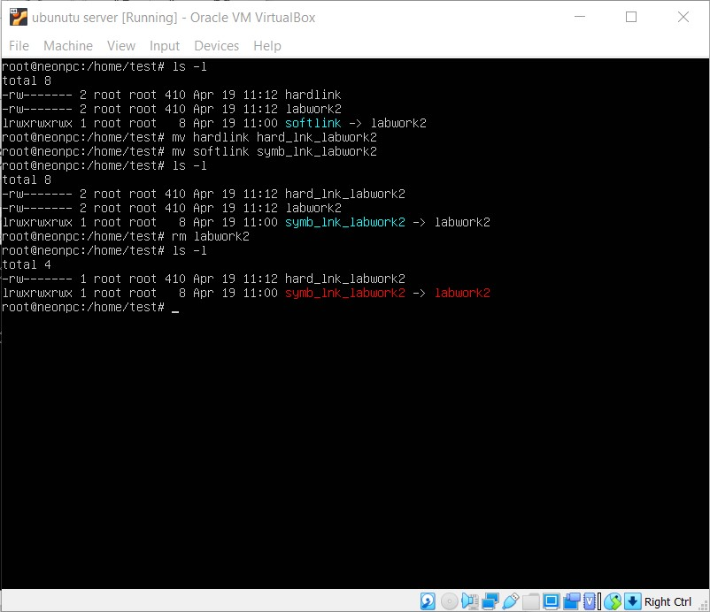

## TASK 4.1

## Part 1

### 1. Logged in to the system as root

  
Click to expand!

  

### 2. Using the *passwd* command to change the password

  
Click to expand!

  

-examining *passwd* command basic parameters by using *man* command

  
Click to expand!

  
  
  

-command *passwd* make changes to such system files - */ets/passwd, /etc/shadow and /etc/pam.d/passwd*

  
Click to expand!

  

### 3. Determining what users are registered in the system (*w*, *who*, *finger* and etc.)

  
Click to expand!

  

-determining what commands users executes (*who -aH*)

  
Click to expand!

  

-additional options can be found in manual by typing *man <command>* or *info <command>*. I have used *man finger* for example

  
Click to expand!

  

### 4. Changing my personal information, using chfn command

  
Click to expand!

  

### 5. Exploring Linux help system and the *man* and *info* commands

  
Click to expand!

  
  
  

 
-geting help on the *chfn* commands

  
Click to expand!

  

-describing two keys for *chfn* commands and giving examples

  
Click to expand!

  

### 6. Exploring the *more* and *less* commands using the help system
-more

  
Click to expand!

  

-less

  
Click to expand!

  

Viewing the contents of file .bashrc using commands:
-using *more .bashrc*

  
Click to expand!

  

-using *less .bashrc*

  
Click to expand!

  

### 7. Determining the last logon time for all users. Using *finger -l* and *last -a* commands

  
Click to expand!

  

### 8. Listing the contents of the home directory using the *ls* command

  
Click to expand!

  

-defining its files and directories (*ls -al*)

  
Click to expand!

  

## Part 2

### 1. Exploring the *tree* command using *man tree* command

  
Click to expand!

  

-Command *tree -aP 'le*'* displaying all files that contain specific sequence of characters *le*

  
Click to expand!

  

-Command *tree -aL 2* lists subdirectories of the root directory up to and including the second nesting level

  
Click to expand!

  

### 2. Using command *file* to determine the type of file

  
Click to expand!

  

### 3. Navigating the file system using *cd* command. Using *cd ~* command to quick navigate user home directory

  
Click to expand!

  

### 4. Exploring *ls* command and its various options. Using *man ls* to get info about command

  
Click to expand!

  

Switch *-a* - displays hidden entries(staring with .)

  
Click to expand!

  

Switch *-l* - displays entries in long listig format

  
Click to expand!

  

### 5. Performing the following sequence of operations:

-сreating a subdirectory *az* in the home directory;
-сreating a file *root.tree* containing information about directories located in the root directory
-viewing the created file

  
Click to expand!

  

-coping created file to your home directory using absolute addressing

  
Click to expand!

  

-coping created file to your home directory using relative addressing

  
Click to expand!

  

-deleting the previously created subdirectory with the file requesting removal
-deleting the file copied to the home directory

  
Click to expand!

  

### 6. Performing the following sequence of operations:
-creating a subdirectory test in the home directory
-coping the .bash_history file to this directory while changing its name to labwork2
-creating a hard and soft link to the labwork2 file in the test subdirectory
-defining soft and hard link, with *ls -al* command

  
Click to expand!

  

-changing data by opening a symbolic link by command *nano softlink*. This will change the content of original labwork2 file (second screenshot, cat labwork2)

  
Click to expand!

  
  

-renaming the hardlink file to hard_lnk_labwork2
-renaming the softlink file to symb_lnk_labwork2 file
-After deleting the labwork2 file, softlink is no more accessible (link displayed in red colour) and hardlink is still existing and storing the copy of labwork2 data

  
Click to expand!

  

### 7. Finding all files that contain the squid and traceroute sequence(using *find /etc -name "example"* command)

  
Click to expand!

  

### 8. Determining which partitions are mounted in the system (df -h), as well as the types of these partitions

  
Click to expand!

  

### 9. Counting the number of lines containing a characters in file proc/mounts using *wc* command

  
Click to expand!

  

### 10. Searching all files in the /etc directory containing the host character sequence

  
Click to expand!

  

### 11. Listing all objects in /etc that contain the ss character sequence, using *grep -r 'ss' /etc* command

  
Click to expand!

  

### 12. Organizing a screen-by-screen print of the contents of the /etc directory with *ls -l /etc | less* command

  
Click to expand!

  

### 13. Listing devices with its type and inf mount point, *df -ahT* command used

  
Click to expand!

  

### 14. Using *file <filename>* determines type of file

  
Click to expand!

  

### 15.* Listing first 5 directory files that were recently accessed in the /etc directory by *ls -lut /etc/ | head -n6* command

  
Click to expand!

  

