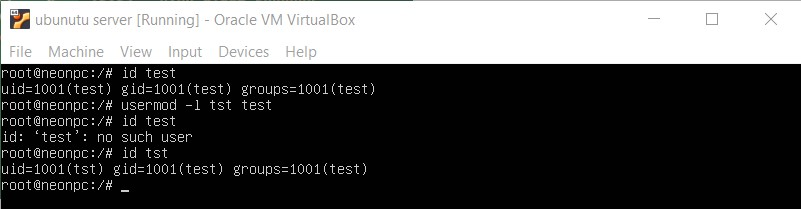
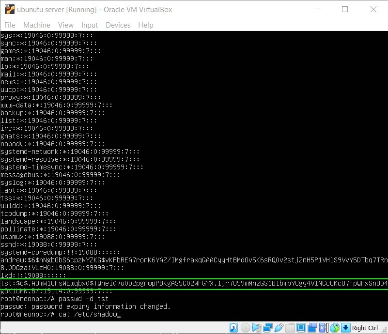

## TASK 4.2

### 1. Analyzing the structure of the /etc/passwd and /etc/group file:

-The /etc/passwd is a plain text file. It contains a list of the system's accounts, giving for each account some useful information like user ID, group ID, home directory, shell, and more. Usinag *cat etc/passwd* command for displaying the contents of file. Pseudo-users are marked by red color and real users by green. Pseudo-users are related to system and program services and has UID 1 to 499, while General users UID is 500-60000

  
Click to expand!

  

-Each line of the /etc/passwd file contains seven comma-separated fields, as depicted at attached screenshot

  
Click to expand!

  

Fields:
1. *Username:* It is used when user logs in. It should be between 1 and 32 characters in length;
2. *Password:* An *x* character indicates that encrypted password is stored in /etc/shadow file;
3. *User ID (UID):* Each user must be assigned a user ID (UID). UID 0 (zero) is reserved for root and UIDs 1-99 are reserved for other predefined accounts. Further UID 100-999 are reserved by system for administrative and system accounts/groups;
4. *Group ID (GID):* The primary group ID (stored in /etc/group file);
5. *User ID Info (GECOS):* The comment field. It allow you to add extra information about the users such as user’s full name, room, office phone number, home phone number etc. This field use by *finger* command;
6. *Home directory:* The absolute path to the directory the user will be in when they log in;
7. *Command/shell:* The absolute path of a command or shell (/bin/bash). Typically, this is a shell.

-The /etc/passwd file stores group information or defines the user groups i.e. it defines the groups to which users belong. Usinag *cat etc/group* command for displaying the contents of file 

  
Click to expand!

  

-There is one entry per line, and each line has the following format (all fields are separated by a colon (:)

  
Click to expand!

  

Fields:
1. *Group_name:* It is the name of group;
2. *Password:* Generally password is not used, hence it is empty/blank. It can store encrypted password. This is useful to implement privileged groups;
3. *Group ID (GID):* Each user must be assigned a group ID. We can see this number in /etc/passwd file;
4. *Group List:* It is a list of user names of users who are members of the group. The user names, must be separated by commas.

### 2. *User ID (UID)*: Is a User ID (UID). UID 0 (zero) is reserved for root and UIDs 1-99 are reserved for other predefined accounts. Further UID 100-999 are reserved by system for administrative and system accounts/groups.

### 3. *Group ID (GID)*: The primary group ID and it is stored in /etc/group file

### 4. View /etc/group file for determining to what group user belong.
For example user *andrew* belongs to groups - *adm, sudo, dip and etc*

  
Click to expand!

  

### 5. To add/create a new user used command *useradd* or *adduser* with *username*. The *username* is a user login name, that is used by a user to login into the system.
For examle adding user - 'test'

  
Click to expand!

  

### 6. To change user name(account name), used command *usermod -l <new_user_name> <existing_user_name>*.
For examle let's change user name 'test' to 'tst'

  
Click to expand!

  

### 7. Directory /etc/skel/ (skel is derived from the “skeleton”) is used to initiate home directory when a user is first created. A sample layout of “skeleton” user files is as shown in example below

  
Click to expand!

  

### 8. To remove user from the system (including his mailbox) used command *userdel -r <existing_user_name>*

  
Click to expand!

  

### 9. To lock user account command *passwd -l <existing_user_name>* used, for unlocking of locked user account *passwd -u <locked_user_name>* command used. To look status of user account - *passwd -S <existing_user_name>* command used as depicted in screenshot below

  
Click to expand!

  

### 10. To remove a user's password and provide him with a password-free login *passwd -d <existing_user_name>* command used
-Contents of the /etc/shadow file BEFORE *passwd -d* command

  
Click to expand!

  

-Contents of the /etc/shadow file AFTER *passwd -d* command

  
Click to expand!

  

### 11. Displaying the extended format of information about the directory, using *ls* command with key *-l*, definition of fields are depictrd on screenshot below

  
Click to expand!

  

### 12. In the access rights(permissions) string, the first character indicates the file type. It can be a regular file (-), directory (d), a symbolic link (l), or other special types of files. The following nine characters represent the file permissions, three triplets of three characters each. The first triplet shows the owner permissions, the second one group permissions, and the last triplet shows everybody else permissions

  
Click to expand!

  

### 13. Here is a quick breakdown of the access that the three basic permission types grant a user.
  Read(r):
  -For a normal file, read permission allows a user to view the contents of the file.
  -For a directory, read permission allows a user to view the names of the file in the directory.

  Write(w):
  -For a normal file, write permission allows a user to modify and delete the file.
  -For a directory, write permission allows a user to delete the directory, modify its contents (create, delete, and rename files in it), and modify the contents of files that the user has write permissions to.

  Execute(x):
  -For a normal file, execute permission allows a user to execute a file (the user must also have read permission). As such, execute permissions must be set for executable programs and shell scripts before a user can run them.
  -For a directory, execute permission allows a user to access, or traverse, into (i.e. cd) and access metadata about files in the directory.

### 14. The command *chmod* used to change the owner of a file (directory). It restricts the way a file can be accessed. For example *chmod u=rwx,g=rx,o=r myfile* uses symbolic permissions notation. The letters u, g, and o stand for "user", "group", and "other". The equals sign ("=") means "set the permissions exactly like this," and the letters "r", "w", and "x" stand for "read", "write", and "execute", respectively. The commas separate the different classes of permissions, and there are no spaces between them. See screenshot below of example in terminal

  
Click to expand!

  

### 15. Here is the equivalent command using octal permissions notation - *chmod 754 myfile*
Here the digits 7, 5, and 4 each individually represent the permissions for the user, group, and others, in that order. Each digit is a combination of the numbers 4, 2, 1, and 0:
    4 stands for "read",
    2 stands for "write",
    1 stands for "execute", and
    0 stands for "no permission."
So 7 is the combination of permissions 4+2+1 (read, write, and execute), 5 is 4+0+1 (read, no write, and execute), and 4 is 4+0+0 (read, no write, and no execute).

The *umask* command returns, or sets, the value of the system's file mode creation mask. For example command *umask u-x,g=r,o+w* will set the mask so that when subsequent files are created, they have permissions that This command:
    1. prohibit the execute permission from being set for the file's owner (user), while leaving the rest of the owner permissions unchanged;
    2. enable read permission for the group, while prohibiting write and execute permission for the group;
    3. enable write permission for others, while leaving the rest of the other permissions unchanged.

### 16. Sticky Bit is a special permissions. The sticky bit can be very useful in shared environment because when it has been assigned to the permissions on a directory it sets it so only file owner can rename or delete the said file. We can only assign the sticky bit by explicitly defining permissions. The character for the sticky bit is *t*. For example to set the sticky bit on a directory named dir1 we use command *chmod +t dir1*

  
Click to expand!

  

### 17. The execute (x) permission grants the ability to execute a file. This permission must be set for executable programs, in order to allow the operating system to run them. For example command *chmod +x testfile* will set execute permission for file *testfile*