## TASK 4.3

## Part 1

### 1. There are five Linux process states. They are as follows: running & runnable, interruptable_sleep, uninterruptable_sleep, stopped, and zombie.

### 2. Using the *pstree -ha* command to make output (highlight) the chain (ancestors) of the current process.

  
Click to expand!

  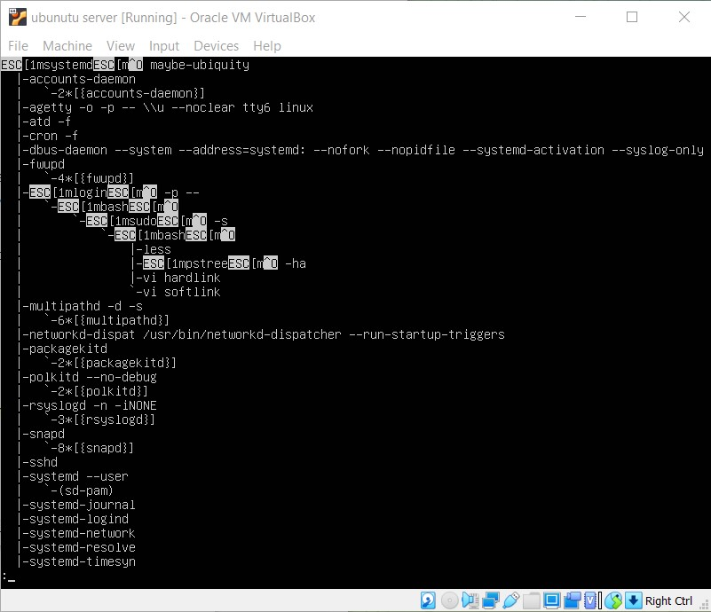

### 3. Proc file system (procfs) is virtual file system created on fly when system boots and is dissolved at time of system shut down. It contains useful information about the processes that are currently running, it is regarded as control and information center for kernel. The proc file system also provides communication medium between kernel space and user space.

### 4. Printing information about the processor using *grep "cpu" /proc/cpuinfo* command

  
Click to expand!

  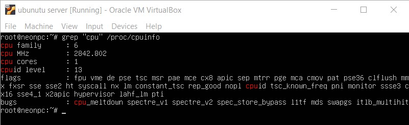

### 5. Using the *ps -eo pid,ppid,fgroup,ni,lstart,etime,user* command to get information about the process.

  
Click to expand!

  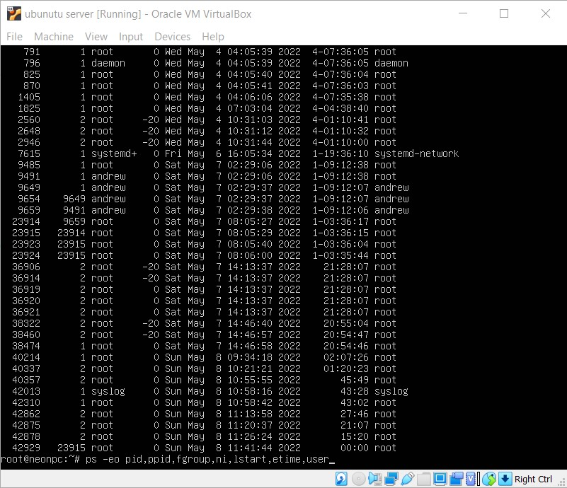

 

### 6. There are two different types of background processes. There are kernel threads. These are a part of the Linux kernel, and each of them is started with its own process identification number (PID). When managing processes, it is easy to recognize the kernel processes because they have a name that is between square brackets.

### 7. Printing the list of processes to the terminal by *ps -aux|head* command.
Brief describtion of the statuses of the processes:\
    USER = user owning the process\
    PID = process ID of the process\
    %CPU = It is the CPU time used divided by the time the process has been running\
    %MEM = ratio of the process’s resident set size to the physical memory on the machine\
    VSZ = virtual memory usage of entire process (in KiB)\
    RSS = resident set size, the non-swapped physical memory that a task has used (in KiB)\
    TTY = controlling tty (terminal)\
    STAT = multi-character process state\
    START = starting time or date of the process\
    TIME = cumulative CPU time\
    COMMAND = command with all its arguments

  
Click to expand!

  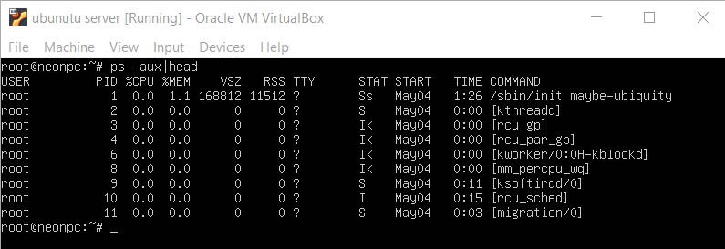

### 8. Using the *ps* command without any arguments, shows only those processes that have been started by the current user.

  
Click to expand!

  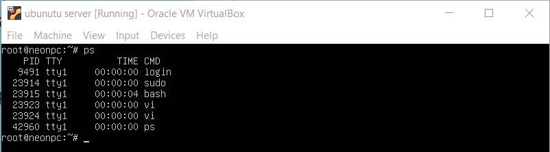

### 9. According to *ps* manual *pgrep, pstree, top* and *proc* utilities can be used to analyze existing running tasks.

  
Click to expand!

  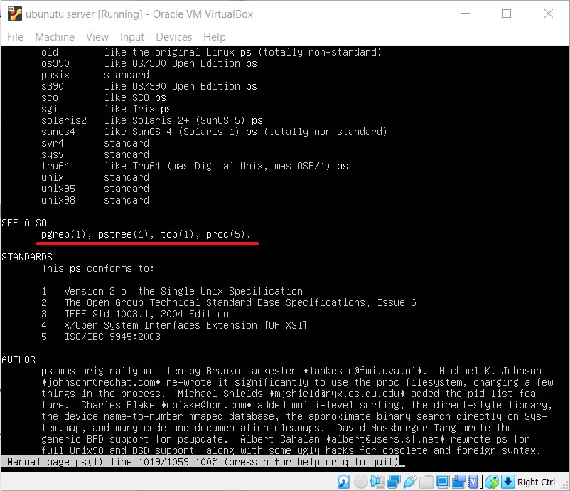

### 10. The top command (table of processes) displays the processor activity of your Linux box and also displays tasks managed by the kernel in real-time. It also shows information about CPU and memory utilization of a list of running processes.

  
Click to expand!

  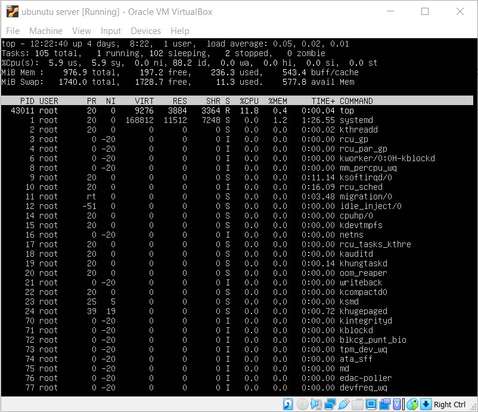

### 11. Displaying the processes of the specific user using the *top -U andrew* command

  
Click to expand!

  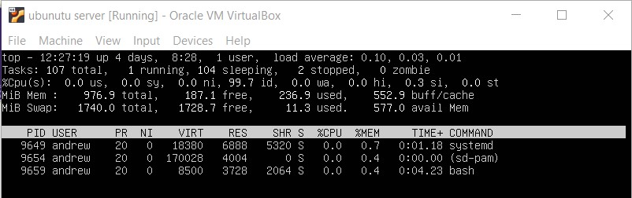

### 12. Listed below(on screenshot) is a brief index of commands within categories. Some commands appear more than once - their meaning or scope may vary depending on the context in which they are issued.

  
Click to expand!

  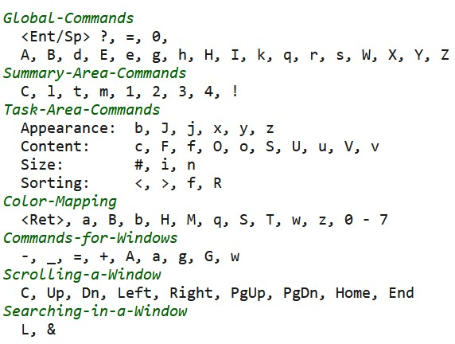

### 13. To sort all Linux running processes by Memory usage, press M and P keys. To sort all Linux running processes by running time, press M and T keys. To sort all Linux running processes by Process ID, press M and T keys.

  
Click to expand!

  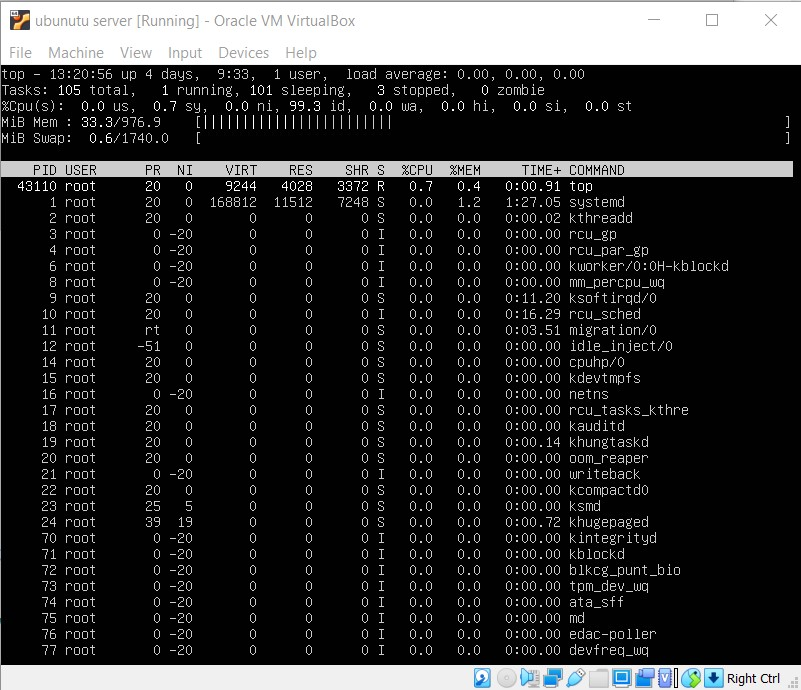

### 14. We can change the process priority using *nice* and *renice* utility. Nice command will launch a process with an user defined scheduling priority. Renice command will modify the scheduling priority of a running process

### 15. Yes, we can change the priority of a process using the top command. By pressing the 'r' key to renice process by ID.

### 16.  To send a signal to a process, the kill command is used. The most common use is the need to stop a process, which you can do by using the kill command followed by the PID of the process. This sends the SIGTERM signal to the process, which normally causes the process to cease its activity. SIGINT (Ctrl + C) – You know this already. Pressing Ctrl + C kills the running foreground process. This sends the SIGINT to the process to kill it.

### 17. When we work with the Linux command line, sometimes we want to start a process and let it run in the background as a job. In this way, it doesn’t block the terminal, and we can do some other work while it’s running. See screenshot below for example.

  
Click to expand!

  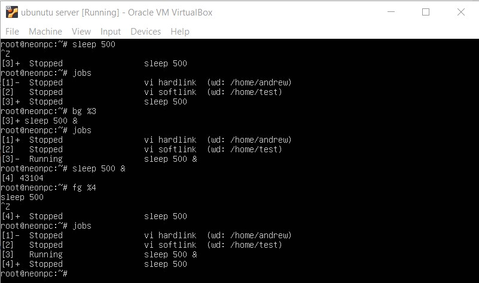

## Part 2

### 1. OpenSSH has been added to Windows (as of autumn 2018), and is included in Windows 10 and Windows Server 2019,  more information can be found at - https://docs.microsoft.com/en-us/windows-server/administration/openssh/openssh_overview

### 2. Using ssh key pairs, and exact remote IP in ssh config will prevent of security threats.

### 3. Listing the options for choosing keys for encryption in SSH.

  
Click to expand!

  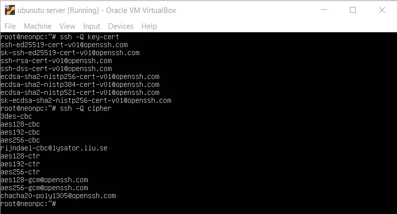

### 4. Implementing port forwarding for the SSH client from the host machine(IP: 192.168.88.2) to the guest Linux virtual machine(IP: 10.0.2.15) behind NAT.

  
Click to expand!

  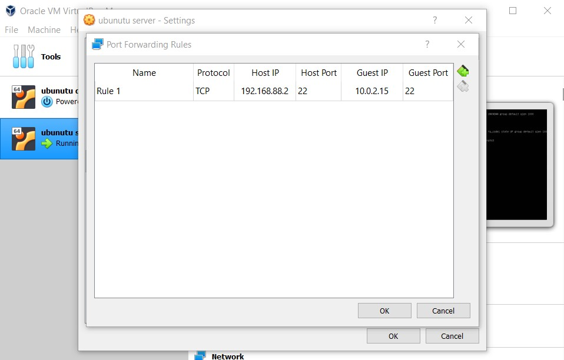
  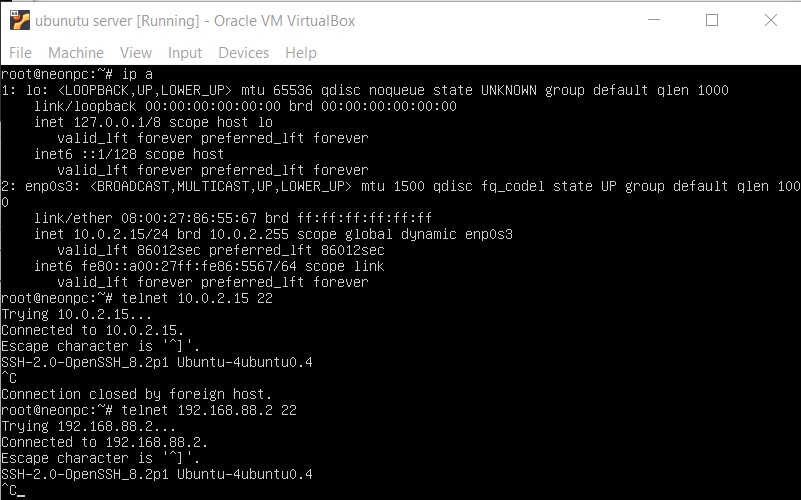

### 5. Intercepting traffic using tshark utility. while authorizing the remote client on the server using ssh, telnet found that telnet haven't any password encryption, while ssh had transfered credentials in envcrypted mode.
