## TASK 5.1

### According to task the network parameters would be next:

| Network name | Network address | Server_1 address | Client_1 address | Client_2 address |
|:------------:|:---------------:|:----------------:|:----------------:|:----------------:|
|     Net1     | 192.168.88.0/24 |    192.168.88.88 |        ---       |       DHCP       |
|     Net2     |   10.84.22.0/24 |       10.84.22.1 |       DHCP       |        ---       |
|     Net3     |    10.8.84.0/24 |        10.8.84.1 |        ---       |        ---       |
|     Net4     |  172.16.22.0/24 |        ---       |      172.16.22.1 |      172.16.22.2 |

Info: on the Net1 (192.168.88.0/24) Router IP - 192.168.88.1

### Network scheme will be next:

  
Click to expand!

  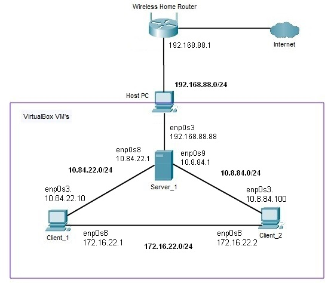

Configuring VM's network settings, as pictured below

  
Click to expand!

  Server_1 config:\
  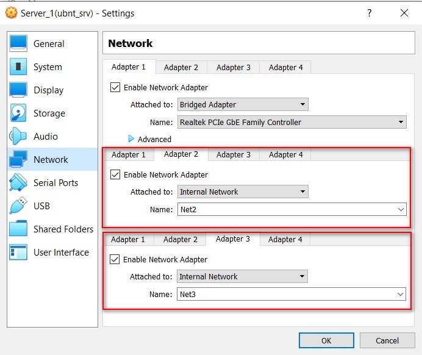
  
  Client_1 config:\
  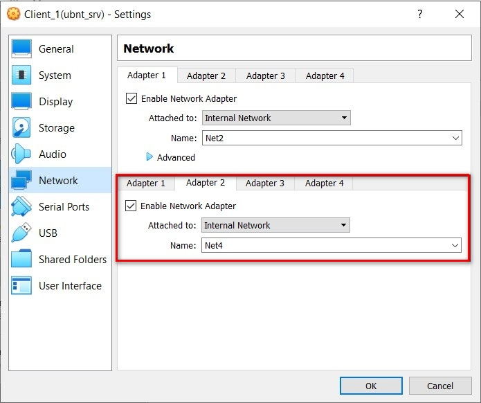
  
  CLient_2 config\
  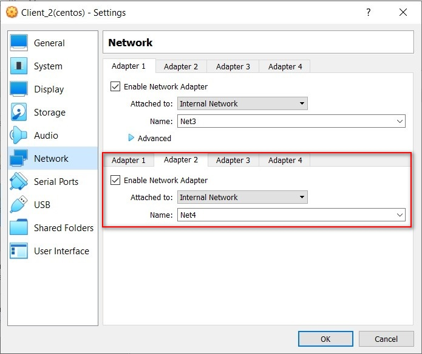

### 1. Configuring static IP addresses on Server_1, using *nano* editor for permanent configuration. See screenshots below.

  
Click to expand!

  -editing cofiguration yaml file with nano\
  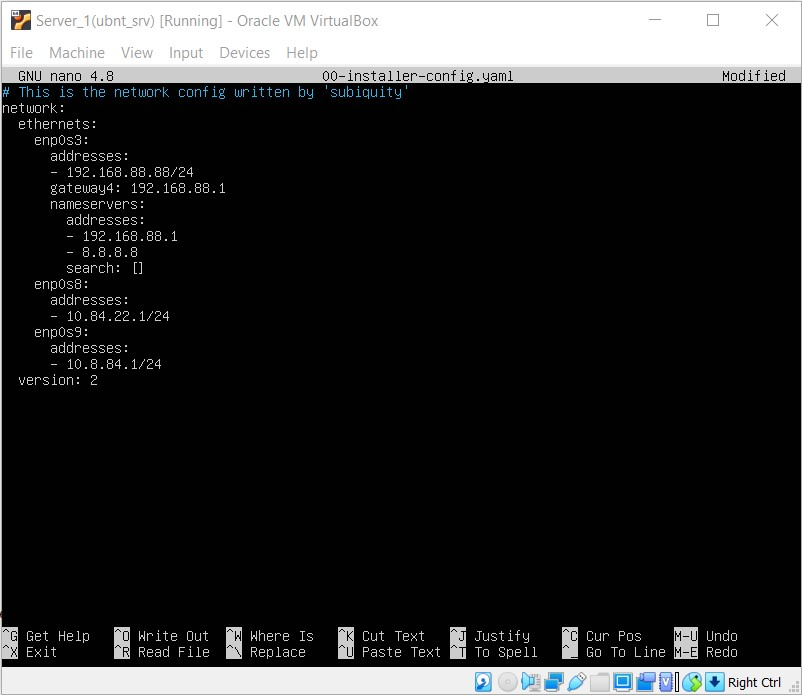
  
  -trying to apply changes using *netplan try*, and applying configuration using *netplan apply*\
  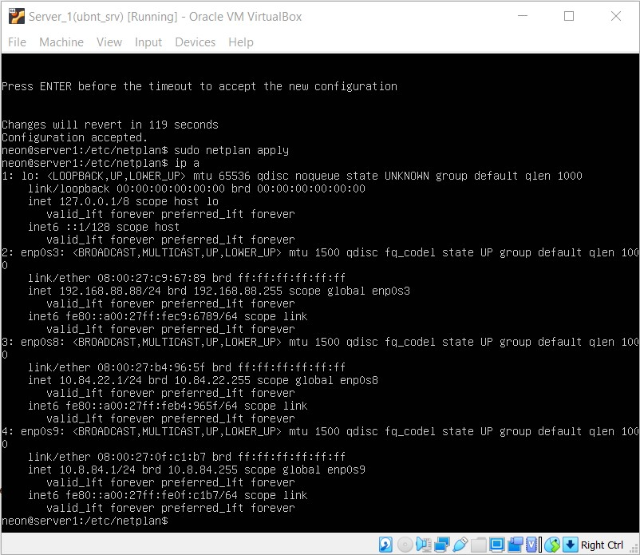

### 2. Configuring DHCP service on Server_1.

  
Click to expand!

  -DHCP service configuratiom file */etc/dhcp/dhcpd.conf*\
  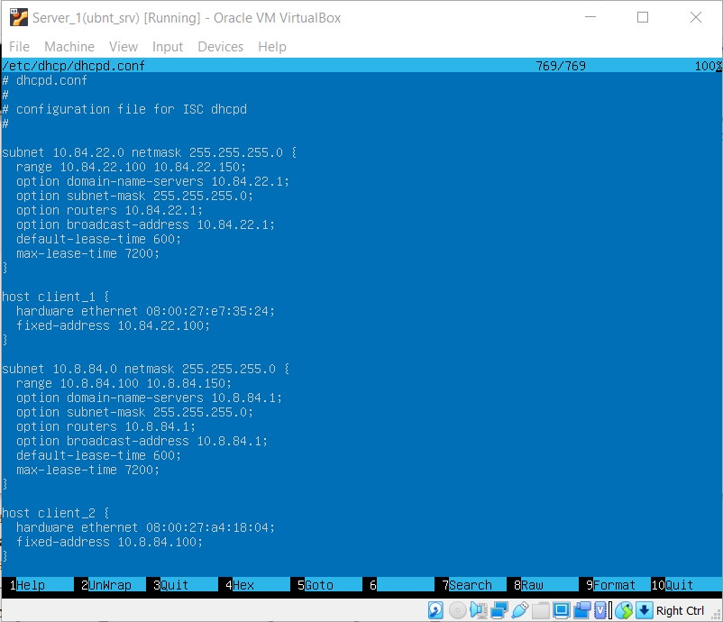
  
  -DHCP service successfully working\
  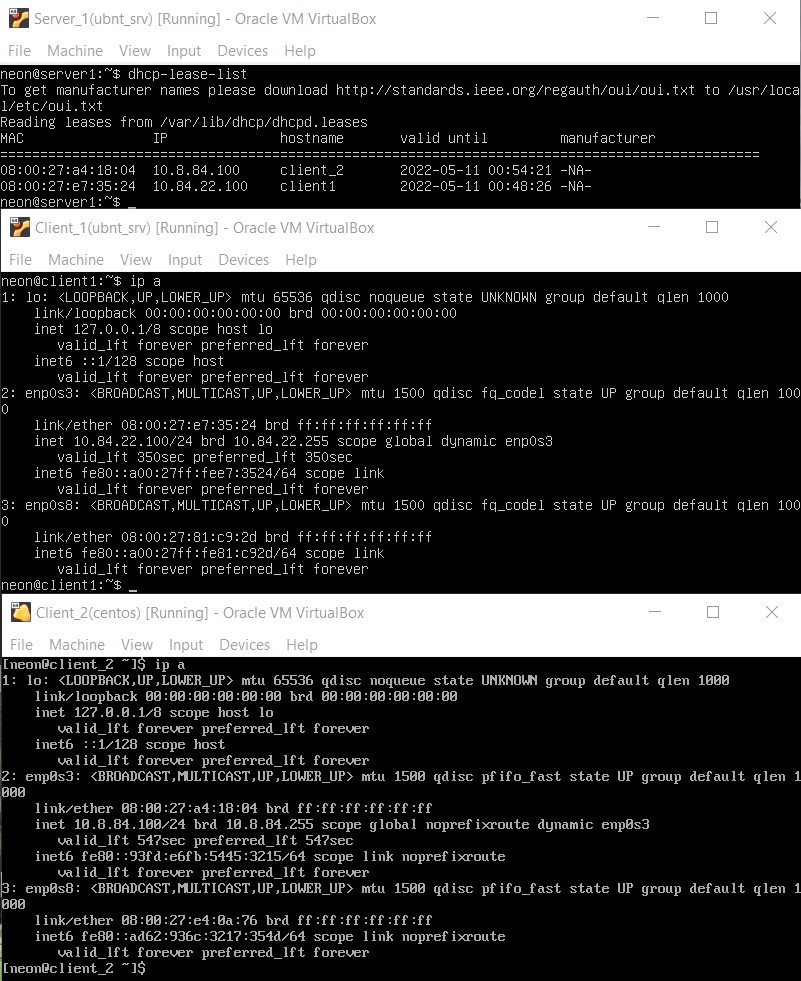

### 3. Connection between Client_1 and Client_2 unavalible, because routes not configured on Server_1. Client's only can reach gateways(both).

  
Click to expand!

  -Client_1(Ubunutu)\
  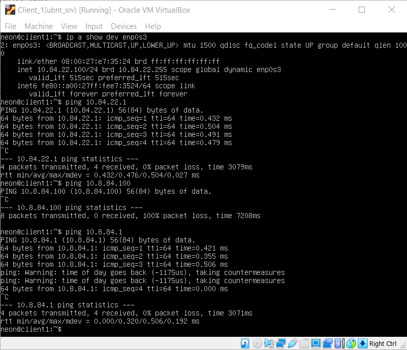
  
  -Client_2(CentOS)\
  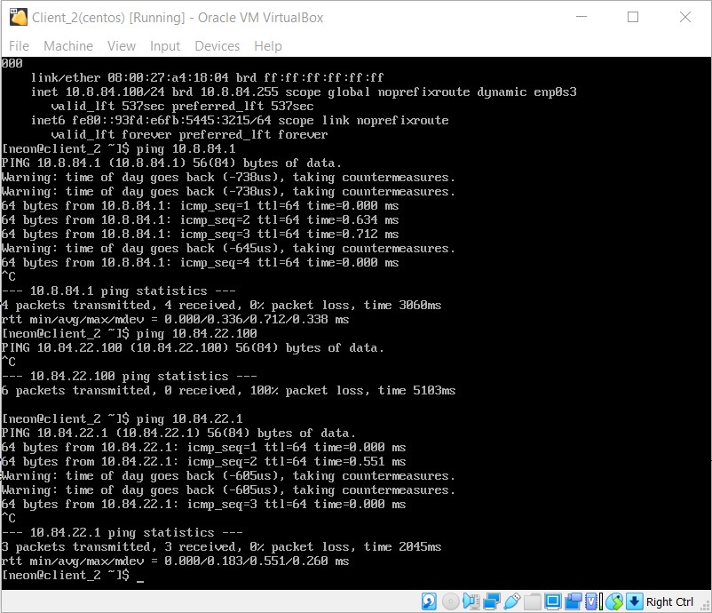

Configuring Server_1 IP v4 forwarding, so it can forward any IP packets to other networks, using command *echo 1 > /proc/sys/net/ipv4/ip_forward*, and configuring router routing table for Net2 and Net3

  
Click to expand!

  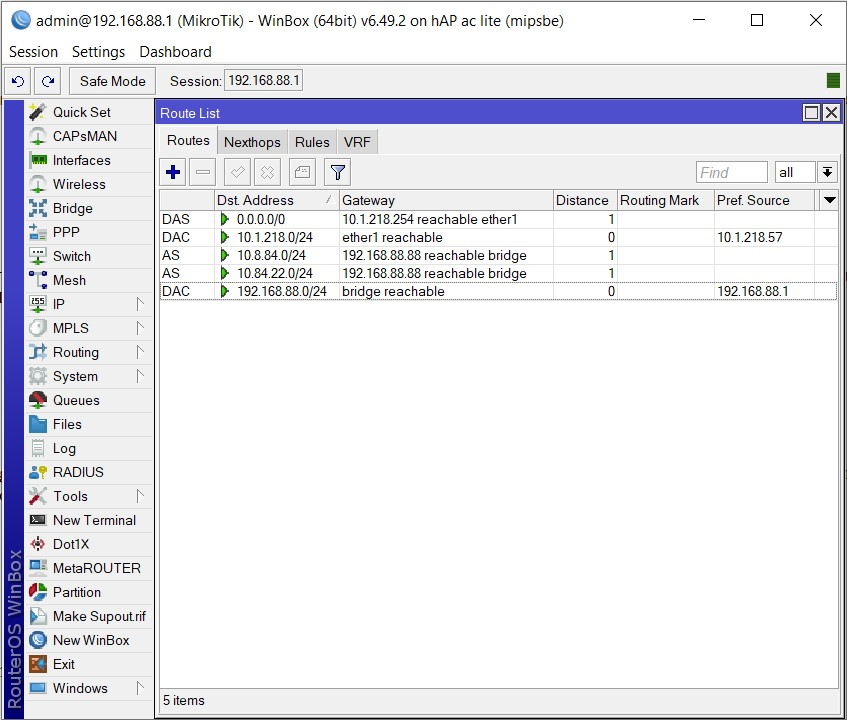

As result Client_1 and Client_2 can reach each other and any global ip address.

  
Click to expand!

  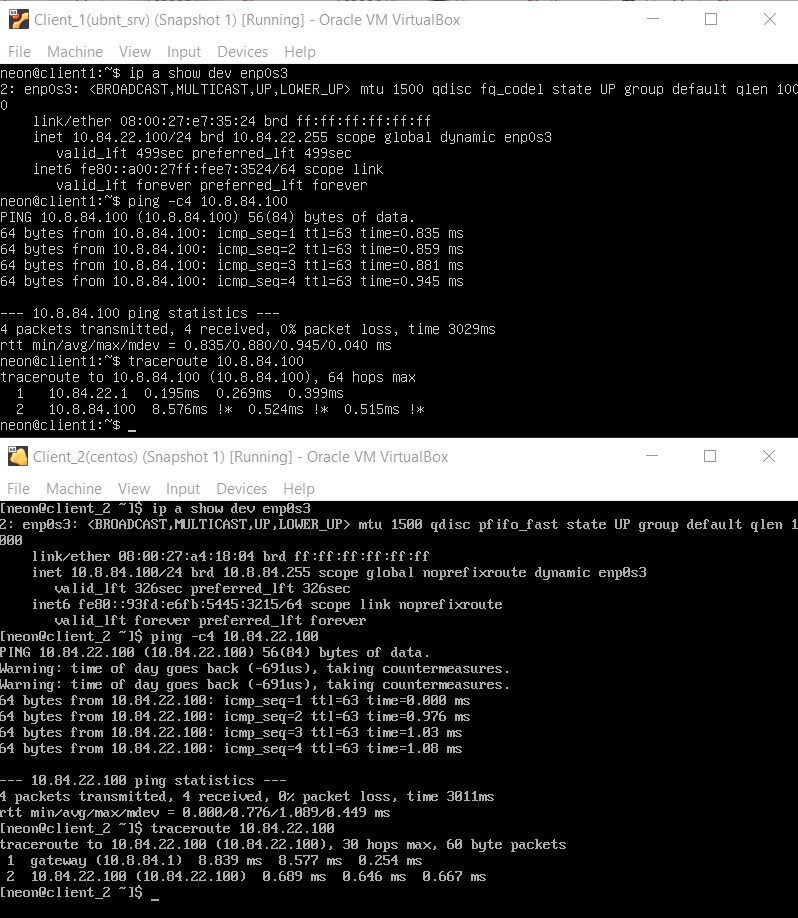

### 4. On Client_1 assigning two IP addresses to lo interface, using the command *ip a add 172.17.32.1/24 dev lo* and *ip a add 172.17.42.1/24 dev lo*, then assigning routes on Client_2 with commands *sudo ip route add 172.17.32.0/24 via 10.8.84.1* and *sudo ip route add 172.17.42.0/24 via 172.16.22.1*. Trying traceroute:

  
Click to expand!

  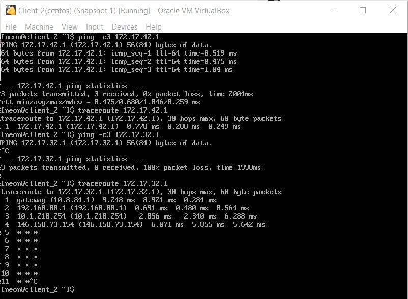

As depicted on screenshot we could see that 172.17.32.1 address is existing someware on the internet, and all traffic in that diaction come thru 10.8.84.1, alongside 172.17.42.1 is now reachable by ping and situated 1 hop avay, so now we can see that routing rules works.

### 5. Summarizinng network address for 172.17.32.0 and 172.17.42.0 networks would be 172.17.0.0/16(Subnet mask 255.255.0.0). Using next commands:
*sudo ip route del 172.17.32.0/24 via 10.8.84.1*
*sudo ip route del 172.17.42.0/24 via 172.16.22.1*
*sudo ip route add 172.17.0.0/16 via 10.8.84.1*
 
 
### 6. Configuring SSH services on clients and server machines. See screenshots for details.

  
Click to expand!

  -Client_1(Ubunutu)\
  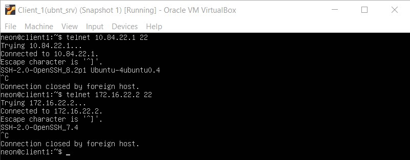
  
  -Client_2(CentOS)\
  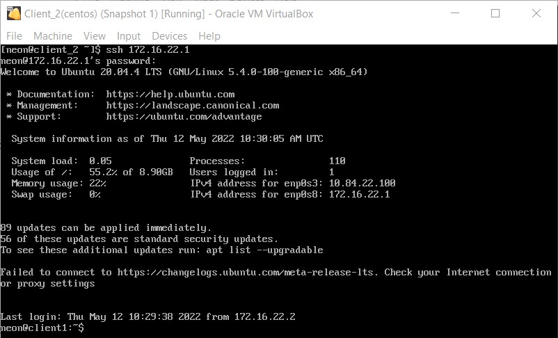
  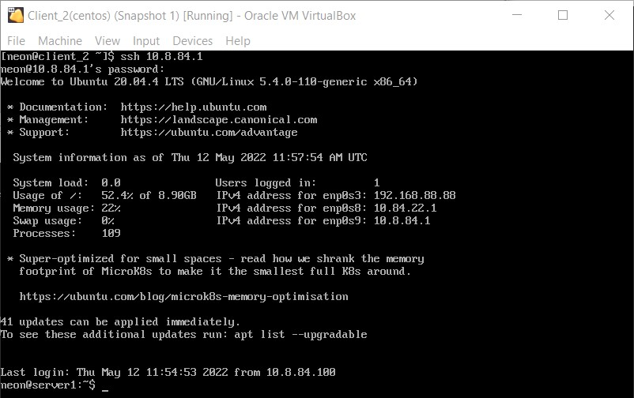

### 7. On Server_1 blocking port 22 fot subnet 10.8.84.0/24, using the command *iptables -I INPUT -s 10.8.84.0/24 -p tcp --dport ssh -j REJECT*, on Client_1 blocking ICMP requests for 172.17.42.1 address using the command *iptables -I INPUT -s 172.17.42.1/24 -p icmp -j REJECT*

### 8. Deleting static routes that was previously configured, and configuring NAT for Net2 and Net3 on Server_1 using the commands *iptables -t nat -A POSTROUTING -o enp0s3 -s 10.8.88.0/24 -j MASQUERADE* and *iptables -t nat -A POSTROUTING -o enp0s3 -s 10.88.29.0/24 -j MASQUERADE*
