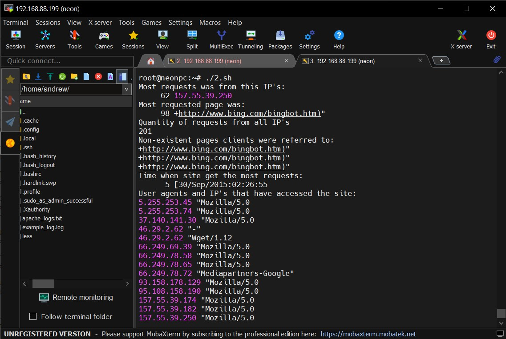
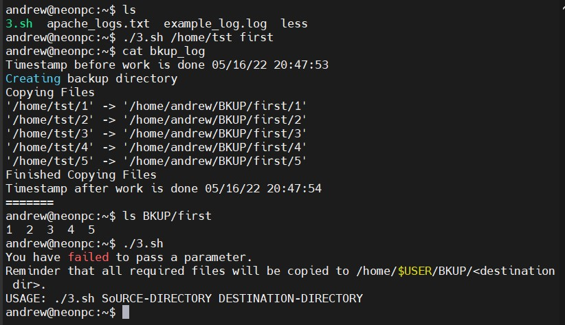

## TASK 6.1


### A. Script that uses *--all* and *--target* keys:
```
#!/bin/bash
echo 'MyScript v0.1'

myip=$(ip addr show dev enp0s3 | grep "inet" | awk 'NR==1{print $2}' | cut -d'/' -f 1)
subnet=$(ip route | awk '/proto/ && !/default/ {print $1}' | head -1)

prt_scn () {
        command=sudo nmap -p 0-65535 $myip
        eval $command
}

scn_subnet () {
        command=sudo nmap -sL $subnet
        eval $command
}

case $1 in
    "")      
            echo 'Use --all key to list all hosts in current subnet or --target to list all open TCP ports for subnet';;
    --all)
            echo Current machine subnet is $subnet
            scn_subnet;;
    --target)
            echo Current machine IP is $myip
            prt_scn;;
    *)
            echo 'Oops! Unknown key or something gone wrong';;
esac
```


### B. Script that analyzes file *Apache.org*:
```
#!/bin/bash

echo "Most requests was from this IP's:"
awk '{print $1}' /home/andrew/apache_logs.txt | sort | uniq -c | sort -nr | head -n 1

echo "Most requested page was:"
awk '{print $15}' /home/andrew/apache_logs.txt | sort | uniq -c | sort -nr | head -n 1

echo "Quantity of requests from all IP's:"
awk '{print $1}' /home/andrew/apache_logs.txt | sort | uniq -c | sort -nr | awk '{ print $1}' | awk 'BEGIN {sum=0} {sum=sum+$1} END {print sum}'

echo "Non-existent pages clients were referred to:"
cat /home/andrew/apache_logs.txt | grep error404 | awk '{print $15}'

echo "Time when site get the most requests:"
awk '{print $4}' /home/andrew/apache_logs.txt | sort | uniq -c | sort -nr | head -n 1

echo "User agents and IP's that have accessed the site:"
awk '{print $1, $12 }' /home/andrew/apache_logs.txt | sort -n | uniq
```

<details>
  <summary>Click to expand!</summary>

  Execution result:\n
  
</details>


### C. Data backup script:
```
#!/bin/bash

# This is a back up script for task C
# back up  to a specific backup directory (/home/$USER/BKUP)
#
# The script requires two parameters - the first is what dir should be backed
# up and the second destination dorectory name. Log should be created
# in /home/$USER/bkup_log file

if [ -z "$1" ] || [ -z "$2" ]; then
	echo "You have failed to pass a parameter."
	echo "Reminder that all required files will be copied to /home/\$USER/BKUP/<destination dir>."
	echo "USAGE: ./3.sh SoURCE-DIRECTORY DESTINATION-DIRECTORY"
	exit 255;
fi

MYLOG=bkup_log
src_dir=$1
dst_dir=$2

function ctrlc {
	rm -rf /home/$USER/BKUP/$2
	rm -f $MYLOG
	echo "Received Ctrl+C"
	exit 255
}

trap ctrlc SIGINT

echo "Timestamp before work is done $(date +"%D %T")" >> $MYLOG

echo "Creating backup directory" >> $MYLOG
if ! (mkdir /home/$USER/BKUP 2> /dev/null)
then
	echo "This is first time script runs" >> $MYLOG
fi
if ! (mkdir /home/$USER/BKUP/$2 2> /dev/null)
then
	echo "Directory already existed. Updating content" >> $MYLOG
fi

echo "Copying Files" >> $MYLOG
cp -rv $src_dir/* /home/$USER/BKUP/$dst_dir >> $MYLOG
echo "Finished Copying Files" >> $MYLOG
echo "Timestamp after work is done $(date +"%D %T")" >> $MYLOG
echo "=======" >> $MYLOG
```

<details>
  <summary>Click to expand!</summary>

  
</details>