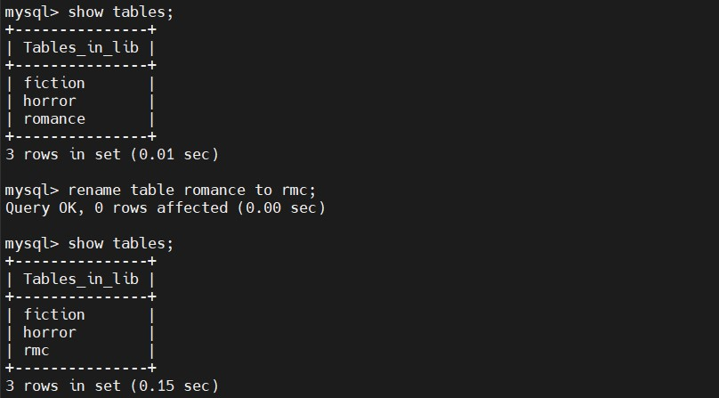
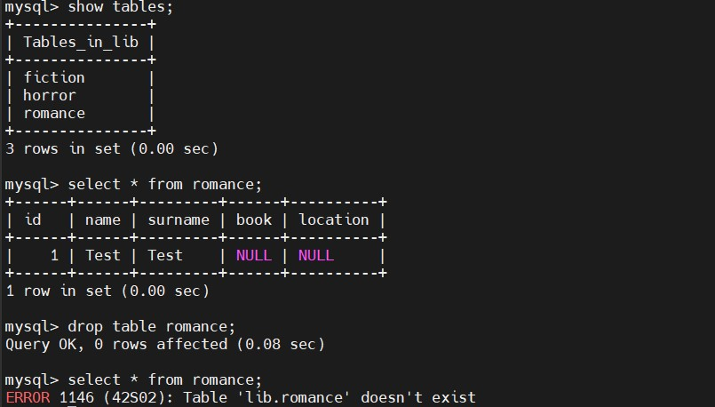
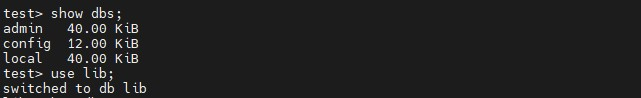

## TASK 7.1


### Part 1

### 1. Downloaded MySQL Server for Ubuntu server VM.


### 2. Intalled MySQL Server on Ubuntu server VM.

<details>
  <summary>Click to expand!</summary>

  
</details>


### 3. Creating database on installed MySQL Server. With such template "Library->Book ganres->Book author".

<details>
  <summary>Click to expand!</summary>

  
</details>


### 4. Creating tables according to choosen template.Tables *horror, fiction* and *romance* was created.

<details>
  <summary>Click to expand!</summary>

  
</details>


### 5. Filling in the tables. Using command ```insert into <table name>(id, name, surname)values('<num>', '<Author Name>','<Autor Surname>');```.
  
-Filling in *fiction* table.
<details>
  <summary>Click to expand!</summary>
  
  
</details>

-Filling in *horror* table.
<details>
  <summary>Click to expand!</summary>

  
</details>

-Filling in *romance* table.
<details>
  <summary>Click to expand!</summary>

  
</details>


### 6. Constructing and executing SELECT operator with WHERE, GROUP BY and ORDER BY

-selecting third row from *horror* table by name with command ```select @n:= name from horror where id = 3;```.
<details>
  <summary>Click to expand!</summary>

  
</details>

-selecting surnames from *horror* table and group them with command ```select surname from horror group by surname;```.
<details>
  <summary>Click to expand!</summary>

  
</details>

-selecting surnames from *horror* table and order them with command ```select surname from horror order by surname;```.
<details>
  <summary>Click to expand!</summary>

  
</details>


### 7. Executing other different SQL queries.

-renaming tables
<details>
  <summary>Click to expand!</summary>

  
</details>

-altering tables
<details>
  <summary>Click to expand!</summary>

  
</details>

-truncating tables
<details>
  <summary>Click to expand!</summary>

  
</details>

-adding new row and updating its content
<details>
  <summary>Click to expand!</summary>

  
</details>

-deleting from tables
<details>
  <summary>Click to expand!</summary>

  
</details>

-deleting from tables
<details>
  <summary>Click to expand!</summary>

  
</details>


### 8. Creating a new users with different privileges. 

<details>
  <summary>Click to expand!</summary>

  -creating a new user *test1*
  

  -granting user *test1* access to lib.horror table
  

  -revoking just created access rights
  

  -granting user *test1* access to grant rights for lib database
  
</details>


### 9. Making a selection from the main table DB MySQL, with command ```select user,host,authentication_string from mysql.user;```.

<details>
  <summary>Click to expand!</summary>

  
</details>


### Part 2

### 10. Making backup of database with command ```sudo mysqldump -uroot -p --all-databases > bkup_all.sql```.

<details>
  <summary>Click to expand!</summary>

  
</details>


### 11. Deleting the table with command ```drop table romance;```.

<details>
  <summary>Click to expand!</summary>

  
</details>


### 12. Restoring the database from back up, using ```sudo mysql -uroot -p mysql < bkup_all.sql``` command.

<details>
  <summary>Click to expand!</summary>

  

  
</details>


### 13. Transfering local database *lib* to RDS AWS. First creating local back up with command ```sudo mysqldump -u root -p lib > bkup_lib.sql```, then transfering database to AWS RDS - ```sudo mysql -u root -p -h lib.cwnyliyx25ih.eu-central-1.rds.amazonaws.com -D lib < bkup_lib.sql```.

<details>
  <summary>Click to expand!</summary>

  
</details>


### 14. Connecting to AWS RDS database with command ```mysql -u root -p -h lib.cwnyliyx25ih.eu-central-1.rds.amazonaws.com --port 3306```

<details>
  <summary>Click to expand!</summary>

  
</details>


### 15. Execuing SELECT operator, similar to step 6.

-mysql> select * from fiction;
<details>
  <summary>Click to expand!</summary>

  
</details>

-mysql> select surname from horror group by surname;
<details>
  <summary>Click to expand!</summary>

  
</details>

-mysql> select surname from horror order by surname;
<details>
  <summary>Click to expand!</summary>

  
</details>


### 16. Create the dump of your database using command ```sudo mysqldump -uroot --result-file=all.sql --all-databases```.

<details>
  <summary>Click to expand!</summary>

  
</details>


### Part 3

### 17. Installing MongoDB on Amazon Linux 2 AWS instance and creating database with xommand ```use lib```.

<details>
  <summary>Click to expand!</summary>

  
</details>


### 18. Creating a collection with command ```db.createCollection('memberships')```.

<details>
  <summary>Click to expand!</summary>

  
</details>


### 19. Inserting a couple of documents into *memberships* collection. Using command ```db.memberships.insertOne({title: 'Basic 6 month', duration: 6, price: {value: 1000, currency: 'UAH'}})```.

<details>
  <summary>Click to expand!</summary>

  
</details>


### 20. Useing ```db.memberships.find({}).pretty()``` to list documents out.

<details>
  <summary>Click to expand!</summary>

  
</details>
