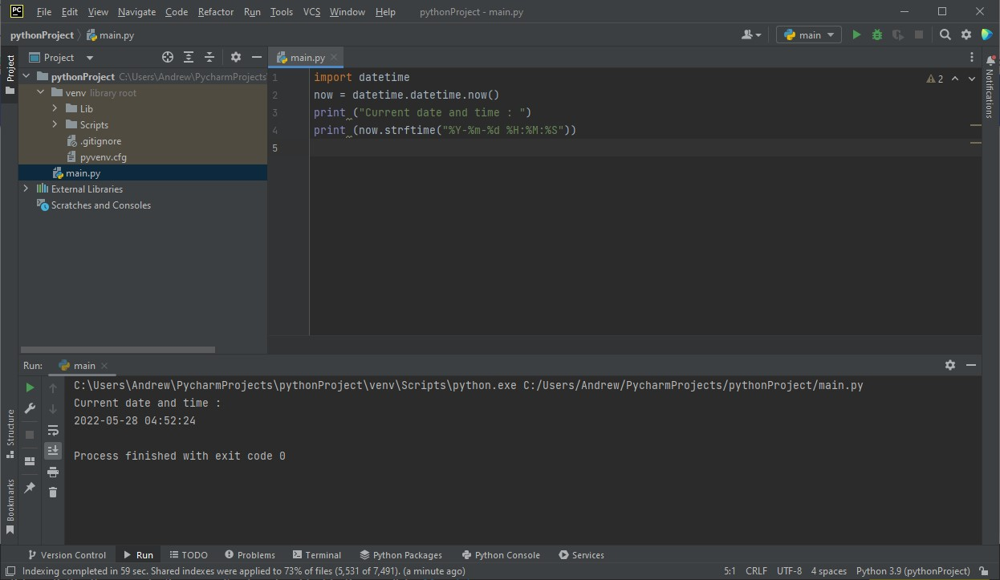
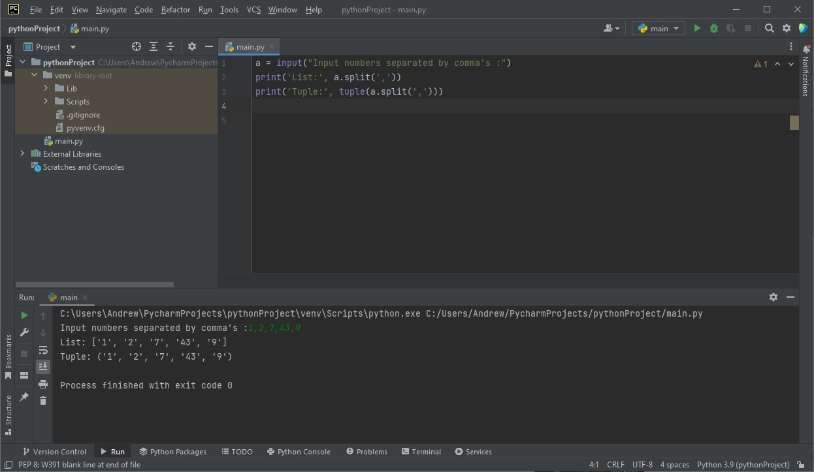
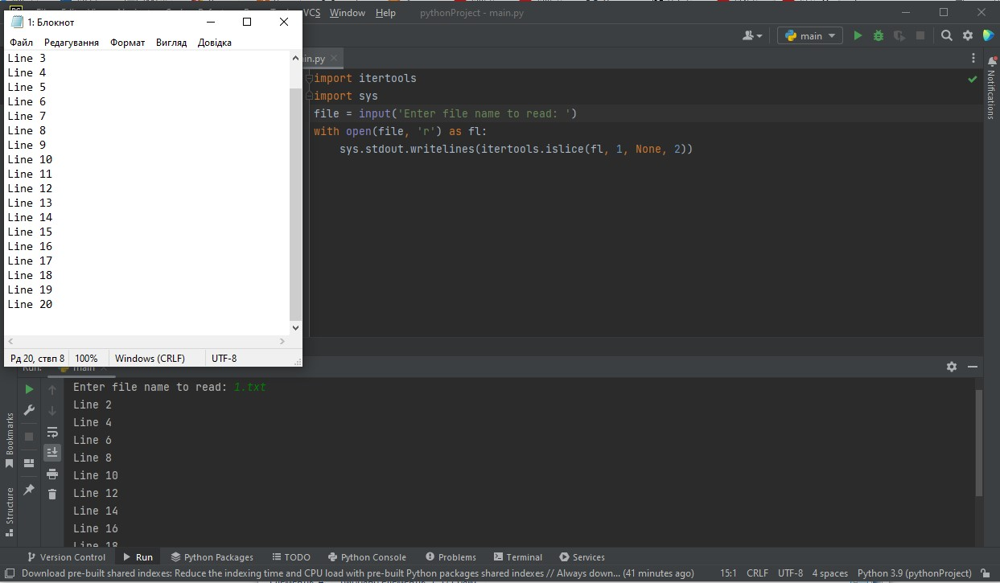
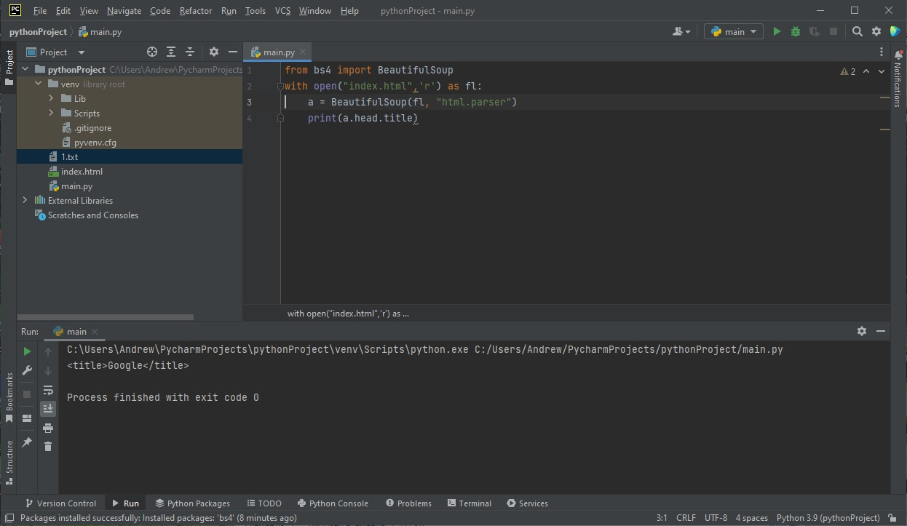
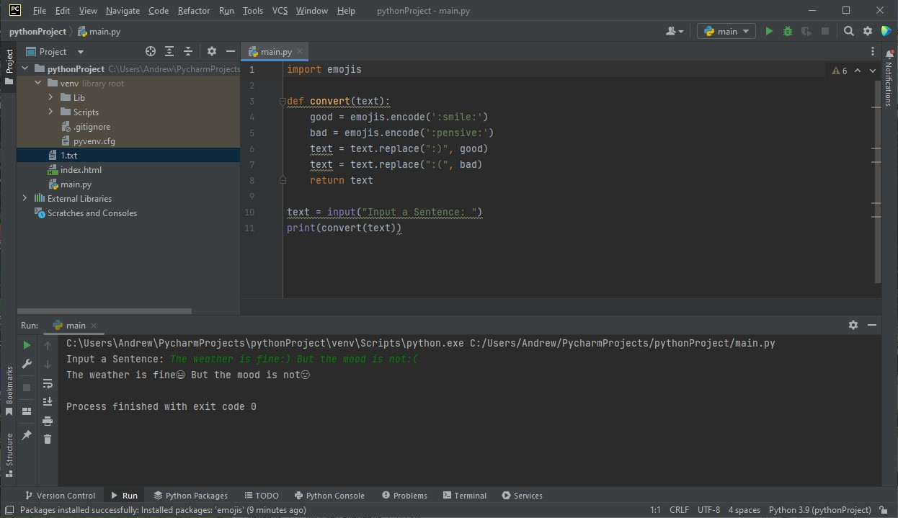
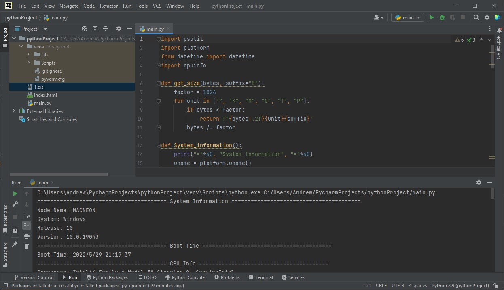

## TASK 8.1


### 1. Python program, which displays current date and time.

```
import datetime
now = datetime.datetime.now()
print ("Current date and time : ")
print (now.strftime("%Y-%m-%d %H:%M:%S"))
```

<details>
  <summary>Click to expand!</summary>

  
</details>


### 2. Python program, which will accept comma-separated numbers, and then it should write tuple and list of them.

```
a = input("Input numbers separated by comma's :")
print('List:', a.split(','))
print('Tuple:', tuple(a.split(',')))
```

<details>
  <summary>Click to expand!</summary>

  
</details>


### 3. Python program, which will ask file name. File should be read, and only even lines should be shown.

```
import itertools
import sys
file = input('Enter file name to read: ')
with open(file, 'r') as fl:
    sys.stdout.writelines(itertools.islice(fl, 1, None, 2))

```

<details>
  <summary>Click to expand!</summary>

  
</details>


### 4. Python program, which should read html document, parse it, and show it’s title.

```
from bs4 import BeautifulSoup
with open("index.html",'r') as fl:
    a = BeautifulSoup(fl, "html.parser")
    print(a.head.title)
```

<details>
  <summary>Click to expand!</summary>

  
</details>


### 5. Python program, which parse user’s text, and replace some emotions with emoji’s.

```
import emojis

def convert(text):
    good = emojis.encode(':smile:')
    bad = emojis.encode(':pensive:')
    text = text.replace(":)", good)
    text = text.replace(":(", bad)
    return text

text = input("Input a Sentence: ")
print(convert(text))
```

<details>
  <summary>Click to expand!</summary>

  
</details>


### 6. Python program, that will show basic PC information (OS, RAM amount, HDD’s, and etc.)

```
import psutil
import platform
from datetime import datetime
import cpuinfo

def get_size(bytes, suffix="B"):
    factor = 1024
    for unit in ["", "K", "M", "G", "T", "P"]:
        if bytes < factor:
            return f"{bytes:.2f}{unit}{suffix}"
        bytes /= factor

def System_information():
    print("="*40, "System Information", "="*40)
    uname = platform.uname()
    print(f"Node Name: {uname.node}")
    print(f"System: {uname.system}")
    print(f"Release: {uname.release}")
    print(f"Version: {uname.version}")
    print("="*40, "Boot Time", "="*40)
    boot_time_timestamp = psutil.boot_time()
    bt = datetime.fromtimestamp(boot_time_timestamp)
    print(f"Boot Time: {bt.year}/{bt.month}/{bt.day} {bt.hour}:{bt.minute}:{bt.second}")
    print("="*40, "CPU Info", "="*40)
    print(f"Processor: {uname.processor}")
    print(f"Processor: {cpuinfo.get_cpu_info()['brand_raw']}")
    print("Physical cores:", psutil.cpu_count(logical=False))
    print("Total cores:", psutil.cpu_count(logical=True))
    cpufreq = psutil.cpu_freq()
    print(f"Max Frequency: {cpufreq.max:.2f}Mhz")
    print(f"Min Frequency: {cpufreq.min:.2f}Mhz")
    print(f"Current Frequency: {cpufreq.current:.2f}Mhz")
    print("="*40, "Memory Information", "="*40)
    svmem = psutil.virtual_memory()
    print(f"Total: {get_size(svmem.total)}")
    print(f"Available: {get_size(svmem.available)}")
    print(f"Used: {get_size(svmem.used)}")
    print(f"Percentage: {svmem.percent}%")
    print("="*40, "Disk Information", "="*40)
    print("Partitions and Usage:")
    partitions = psutil.disk_partitions()
    for partition in partitions:
        print(f"=== Device: {partition.device} ===")
        print(f"  Mountpoint: {partition.mountpoint}")
        print(f"  File system type: {partition.fstype}")
        try:
            partition_usage = psutil.disk_usage(partition.mountpoint)
        except PermissionError:
            continue
        print(f"  Total Size: {get_size(partition_usage.total)}")
        print(f"  Used: {get_size(partition_usage.used)}")
        print(f"  Free: {get_size(partition_usage.free)}")
        print(f"  Percentage: {partition_usage.percent}%")
    disk_io = psutil.disk_io_counters()
    print(f"Total read: {get_size(disk_io.read_bytes)}")
    print(f"Total write: {get_size(disk_io.write_bytes)}")
    print("="*40, "Network Information", "="*40)
    if_addrs = psutil.net_if_addrs()
    for interface_name, interface_addresses in if_addrs.items():
        for address in interface_addresses:
            print(f"=== Interface: {interface_name} ===")
            if str(address.family) == 'AddressFamily.AF_INET':
                print(f"  IP Address: {address.address}")
                print(f"  Netmask: {address.netmask}")
                print(f"  Broadcast IP: {address.broadcast}")
            elif str(address.family) == 'AddressFamily.AF_PACKET':
                print(f"  MAC Address: {address.address}")
                print(f"  Netmask: {address.netmask}")
                print(f"  Broadcast MAC: {address.broadcast}")

if __name__ == "__main__":
    System_information()
```

<details>
  <summary>Click to expand!</summary>

  
</details>