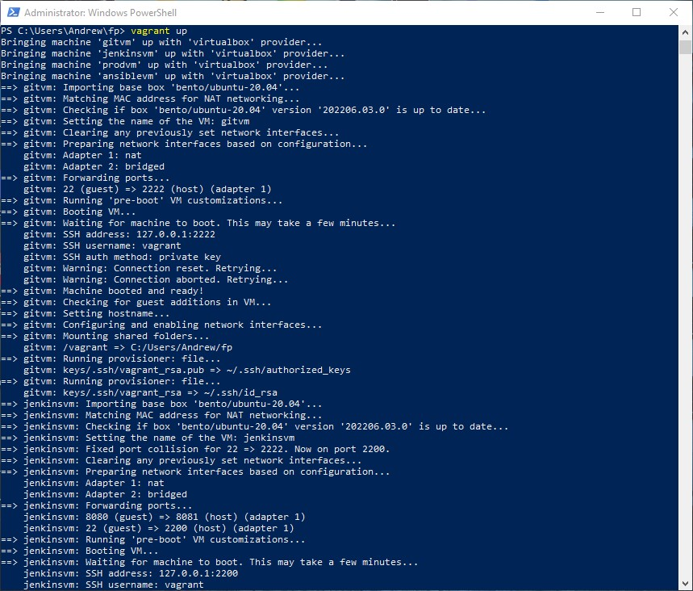
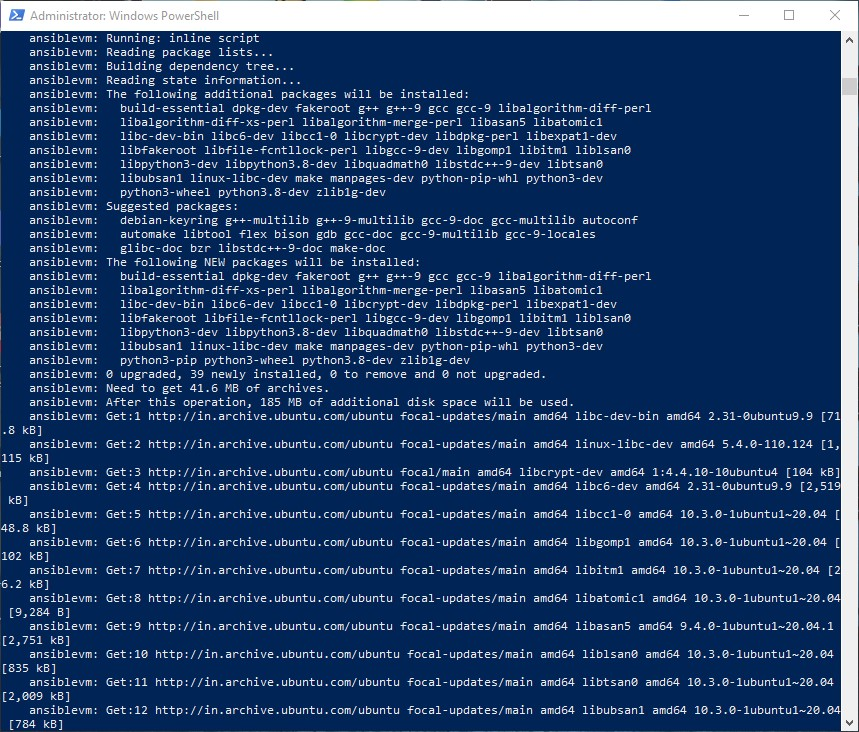
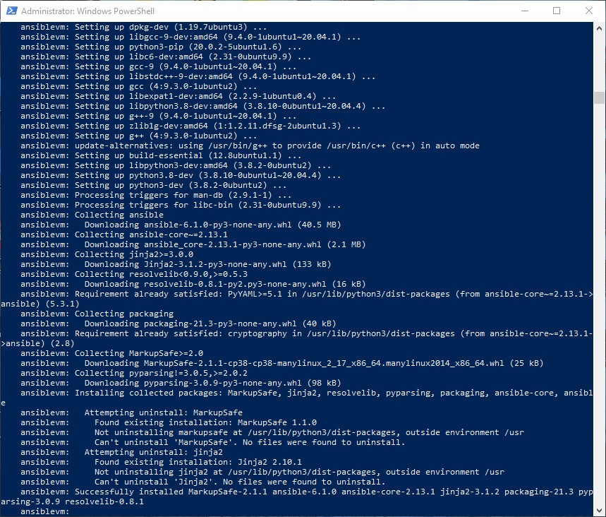
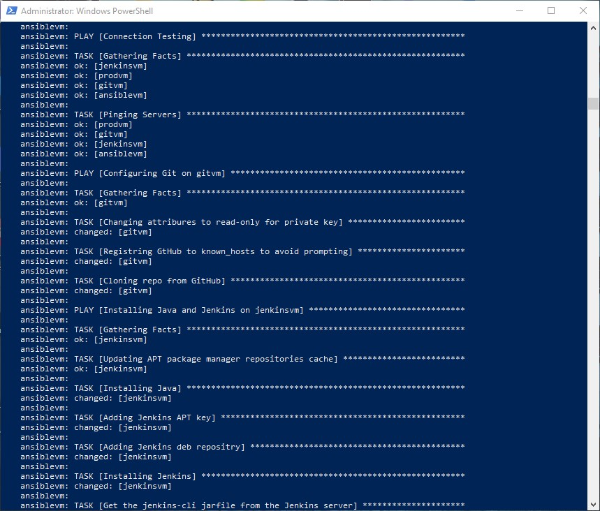
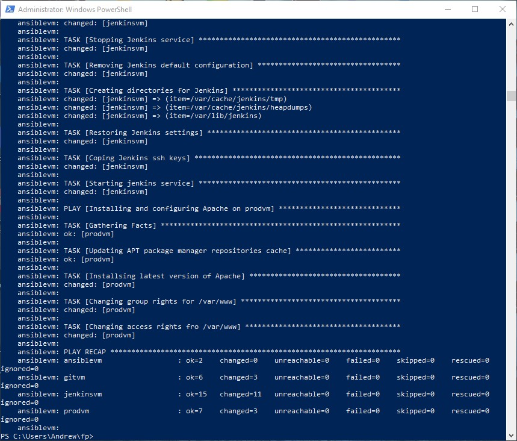

# FINAL PROJECT

Contents:
Presentation file: ```FinalProject.ppt(would be updated soon)```  
Vagrant configuration file: ```Vagrantfile```  
Ansible playbook: ```ansible/config.yml```  
Ansble hosts file: ```ansible/hosts.ini```  
Public SSH Key: ```keys/.ssh/vagrant_rsa```  
Private SSH Key: ```keys/.ssh/vagrant_rsa.pub```  
Brief description: This file(```readme.md```)  
  

## FEW WORDS ABOUT MYSELF

## FINAL PROJECT IN-BRIEF
As a task for final project, I've decided to use DevOps tools Vagrant and Andible to build virtual infrastructure for implementation of simple CI/CD pipline(Described on a pictur below). 

<details>
  <summary>Click to expand!</summary>

  
</details>

That kind of CI/CD piplaine requires to have infructure deployment with at leasr 3 machines:
1. operators machine with git installed and configured to push code to GitHub repository
2. jenkins master machine with Jenkins installed and configured to coonect and get code feom GitHub repository and push it to production
3. production machine with Apache service installed and configured to accept code pushed by Jenkins   
But in my case to arrange quick automation of infrastructure deployment, I decided to use Ansible connfiguration managment and automation platform tool. And cause I'm using Windows-based host machine, I cant start Ansible localy, so I required 1 more virtual machine to use it in role of Ansible master configuration host.  
4. ansible master machine  

Scheme of the deployed infrastructure
<details>
  <summary>Click to expand!</summary>

  
</details>

For building planned infrastucture I've choosed Vagrant tool. Vagrant gives you a disposable environment and consistent workflow for developing and testing infrastructure management scripts.  
Cause my host machine is not so powerful, I've choosed such system params for Vagrant VM's:
1. git mashne - 1 cpu, 512 Mb of RAM
2. jenkins host - 1 cpu, 2048 Mb of RAM
3. apache host - 1 cpu, 1024 Mb of RAM
4. ansible host - 1 cpu, 1024 Mb of RAM  

So I build ```Vagrantfile``` according to requirments, note that Ansoible host machine must be raised last, caouse it will provision all rest machines, and they must be booted up before Ansible playbook begin to run.
Also I have used Vagrant provisioning to install Ansible, copy required files and launch Ansible-playbook.
Next Step, was to create Ansible-playbook that will control all the raused infrastructure. Note, that I'm using only one pre-generated SSH key to work with all infrastructure machines.
Ansible-playbook that I have created, has the next steps:
1. Ensure all VM's from hosts.ini file started right and are accessible
2. For git machine - install all needed SSH keys, and configuratin, and do git clone from known GitHub repository
3. For jenkins machine - installs SSH keys, install software and jenkons, restores jenkins configuration and tasks, install jenkins plugins
4. For apache machine - install and upadate Apache service, arranges rights for ```/var/www/```  

After all scripts was written, all I need to raise infrastructure with working pipeline is to run PowerShell on my Windows-based machine, change dirictory to my project and run ```vagrant up``` command.
So let's se what happens on the screen, when we execute ```vagrant up``` command.  
<details>
  <summary>Click to expand!</summary>

  
</details>  

Next important moment while script runs is moment when Vagrant starts provisioning an Ansible host.
<details>
  <summary>Click to expand!</summary>

  
</details>  

In this part of script vagrant is installing python-pip required for Ansiblw installation, and then installs ansible
<details>
  <summary>Click to expand!</summary>

  
</details>  

After Anisble has installed, ansible-playbook executed and continues to provision Git, Jenkins and Apache VM's.
<details>
  <summary>Click to expand!</summary>

  
</details>  

And after all playbook scipts complete, infrastrucrure is up and able to work.
<details>
  <summary>Click to expand!</summary>

  
</details>  

Run vagrant up  
to be updated soon...
