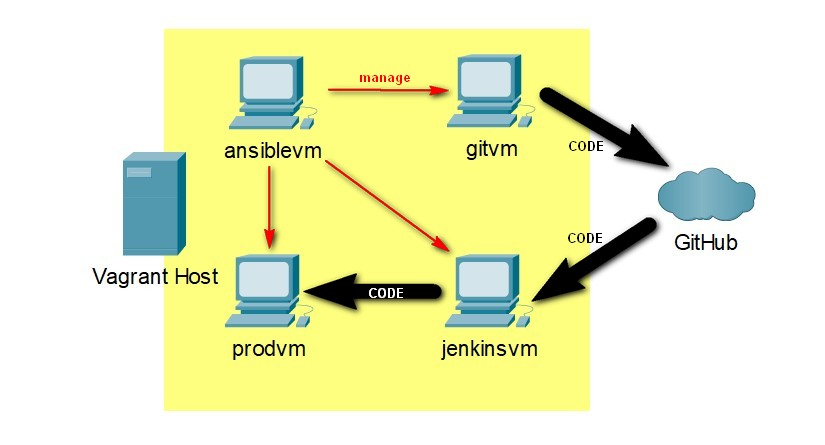

# FINAL PROJECT

Contents:
Presentation file: ```FinalProject.ppt(would be updated soon)```  
Vagrant configuration file: ```Vagrantfile```  
Ansible playbook: ```ansible/config.yml```  
Ansble hosts file: ```ansible/hosts.ini```  
Public SSH Key: ```keys/.ssh/vagrant_rsa```  
Private SSH Key: ```keys/.ssh/vagrant_rsa.pub```  
Brief description: This file(```readme.md```)  
  

## FEW WORDS ABOUT MYSELF

## FINAL PROJECT IN-BRIEF
As a task for final project, I\ve decided to use DevOps tools Vagrant and Andible to build virtual infrastructure for implementation of simple CI/CD pipline(Described on a pictur below). 

<details>
  <summary>Click to expand!</summary>

  
</details>

That kind of CI/CD piplaine requires to have infructure deployment with at leasr 3 machines:
1. operators machine with git installed and configured to push code to GitHub repository
2. jenkins master machine with Jenkins installed and configured to coonect and get code feom GitHub repository and push it to production
3. production machine with Apache service installed and configured to accept code pushed by Jenkins
To arrange quick automation of infrastructure deployment, I decided to use Ansible connfiguration managment and automation platform tool. And cause I'm using Windows-based host machine, I cant start Ansible localy, so I required 1 more virtual machine to use it in role of Ansible master configuration host.
4. ansible master machine

Scheme of the deployed infrastructure
<details>
  <summary>Click to expand!</summary>

  
</details>

After analyzing of requirments, next Vagrantfile was created:
```
VAGRANTFILE_API_VERSION = "2"

$ansible_master = <<-'SCRIPT'
sudo chmod 400 .ssh/vagrant_rsa
sudo apt-get --assume-yes install python3-pip
sudo pip install --no-input ansible
su --login -c "ansible-playbook config.yml -i hosts.ini" vagrant
SCRIPT

Vagrant.configure(VAGRANTFILE_API_VERSION) do |config|
# Use the same key for each machine
  config.ssh.insert_key = false
  config.ssh.private_key_path = ["keys/.ssh/vagrant_rsa", "~/.vagrant.d/insecure_private_key"]

  config.vm.define "gitvm" do |vm1|
    vm1.vm.box = "bento/ubuntu-20.04"
    vm1.vm.network "public_network", ip: "192.168.88.50"
    # vm1.vm.network "forwarded_port", guest: 22, host: 2222
    vm1.vm.hostname = "gitvm"
    vm1.vm.provision "file", source: "keys/.ssh/vagrant_rsa.pub", destination: "~/.ssh/authorized_keys"
    vm1.vm.provider "virtualbox" do |vb|
      vb.name = "gitvm"
      vb.customize ["modifyvm", :id, "--memory", "512"]
      vb.customize ["modifyvm", :id, "--cpus", "1"]
    end
  end
  config.vm.define "jenkinsvm" do |vm2|
    vm2.vm.box = "bento/ubuntu-20.04"
    vm2.vm.network "public_network", ip: "192.168.88.51"
    # , bridge: "wlo1"
    # vm2.vm.network "forwarded_port", guest: 22, host: 2200
    vm2.vm.network "forwarded_port", guest: 8080, host: 8081
    vm2.vm.hostname = "jenkinsvm"
    vm2.vm.provision "file", source: "keys/.ssh/vagrant_rsa.pub", destination: "~/.ssh/authorized_keys"
    vm2.vm.provider "virtualbox" do |vb|
      vb.name = "jenkinsvm"
      vb.customize ["modifyvm", :id, "--memory", "2048"]
      vb.customize ["modifyvm", :id, "--cpus", "1"]
    end
  end
  config.vm.define "prodvm" do |vm3|
    vm3.vm.box = "bento/ubuntu-20.04"
    vm3.vm.network "public_network", ip: "192.168.88.52"
    # vm3.vm.network "forwarded_port", guest: 22, host: 2201
    vm3.vm.network "forwarded_port", guest: 80, host: 8000
    vm3.vm.hostname = "prodvm"
    vm3.vm.provision "file", source: "keys/.ssh/vagrant_rsa.pub", destination: "~/.ssh/authorized_keys"
    vm3.vm.provider "virtualbox" do |vb|
      vb.name = "prodvm"
      vb.customize ["modifyvm", :id, "--memory", "1024"]
      vb.customize ["modifyvm", :id, "--cpus", "1"]
    end
  end
  config.vm.define "ansiblevm" do |vm4|
    vm4.vm.box = "bento/ubuntu-20.04"
    vm4.vm.network "public_network", ip: "192.168.88.53"
    # vm4.vm.network "forwarded_port", guest: 22, host: 2202
    vm4.vm.hostname = "ansiblevm"
    vm4.vm.provision "file", source: "keys/.ssh/vagrant_rsa.pub", destination: "~/.ssh/authorized_keys"
    vm4.vm.provider "virtualbox" do |vb|
      vb.name = "ansiblevm"
      vb.customize ["modifyvm", :id, "--memory", "512"]
      vb.customize ["modifyvm", :id, "--cpus", "1"]
    end
    vm4.vm.provision "file", source: "keys/.ssh/vagrant_rsa", destination: "~/.ssh/vagrant_rsa"
    vm4.vm.provision "file", source: "ansible/config.yml", destination: "~/config.yml"
    vm4.vm.provision "file", source: "ansible/hosts.ini", destination: "~/hosts.ini"
    vm4.vm.provision "file", source: "ansible/.ansible.cfg", destination: "~/.ansible.cfg"
    vm4.vm.provision "shell", inline: $ansible_master
    # This option should be used if host machine supports Ansible
    # vm4.vm.provision "ansible", playbook: "config.yml", inventory_path: "hosts.ini", limit: "all" 
  end
end
```


For building infrastucture
Vagrant gives you a disposable environment and consistent workflow for developing and testing infrastructure management scripts.
Infrastructure It consists from 4 steps:
1. Worksaton with git installed and configured
2. Jenkins master workstation
3. Product workstation with Apache installed and configured
4. Ansible master workstation

All workstations are deployed with Vagrant virtual machine environments building and managment tool.


## MODEL/VISION

## IMPLEMENTATION

### 1. Vagrant code.

